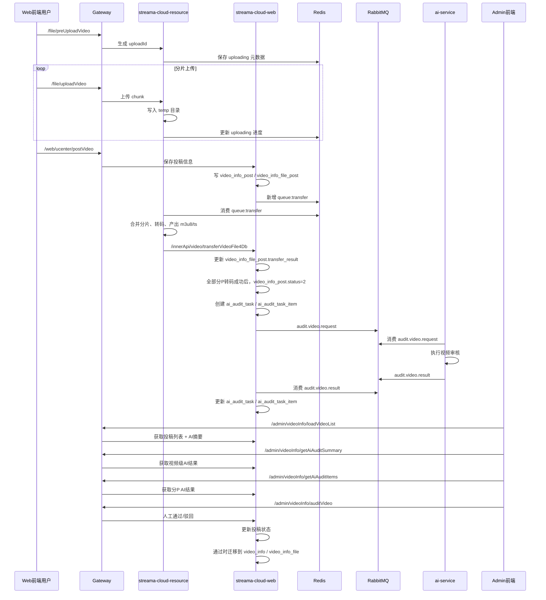

# Admin 视频 AI 审核设计说明

## 1. 结论摘要

### 1.1 当前数据库设计是否满足 admin 前端展示需要

结论：**部分满足，属于“基础可用，但端到端还不完全满足”**。

当前表设计里：

- `ai_audit_task` 已能承载“视频级 AI 审核结果”
- `ai_audit_task_item` 已能承载“分 P / 分文件 AI 审核结果”
- `video_info_post` / `video_info_file_post` 已能承载“投稿态、转码态、待审核态”
- `video_info` / `video_info_file` 已能承载“人工审核通过后正式生效的数据”

因此，从**数据库分层设计**看，当前拆分思路是合理的，并不需要把 AI 审核字段直接塞进 `video_info_post` 主表。

但是，站在 **admin 前端实际要展示的内容** 来看，当前仍有明显缺口：

1. 列表页当前只能联出 `aiDecision`、`aiRiskLevel`、`aiSummary`，**缺少 AI 任务状态、完成时间、失败原因**
2. 分 P 明细虽然能存 `riskTagsJson` / `hitSegmentsJson`，但当前接口直接返回字符串，**不够前端友好**
3. AI 命中段当前只有 `time` 字符串，没有结构化 `startSeconds` / `endSeconds`
4. AI 命中段当前没有可供 admin 直接读取的 `bestFramePath`
5. 当前 admin 前端页面实际上**还没有接入 AI 摘要和 AI 明细接口**
6. 当前“编辑已存在视频但不新增文件”的路径，会进入待审核，但**不会自动创建新的 AI 审核任务**

### 1.2 当前代码层面的总体判断

- **数据库层面**：基础满足
- **查询接口层面**：部分满足
- **admin 前端层面**：当前未满足目标审核体验
- **AI 服务返回结构层面**：当前未满足“时间 + 截图定位”的目标

一句话总结：

> 当前库表已经够承载 admin AI 审核数据，但还缺少若干关键字段输出、结构化命中信息和命中截图落地方案，所以目前只能算“AI 审核结果已入库”，还不能算“admin 审核展示设计已闭环”。

## 2. Admin 前端需要展示什么

本节分成三部分写：`当前已展示`、`目标列表页`、`目标审核详情`。

### 2.1 当前 admin 页面实际已展示的内容

当前页面代码：`streama-frontend/streama-admin/src/views/VideoAuditView.vue`

当前实际展示项如下：

| 前端展示项 | 当前是否已展示 | 当前来源接口 | 当前来源表字段 |
| --- | --- | --- | --- |
| 视频封面 | 是 | `/admin/videoInfo/loadVideoList` | `video_info_post.video_cover` |
| 视频标题 | 是 | `/admin/videoInfo/loadVideoList` | `video_info_post.video_name` |
| 投稿状态 | 是 | `/admin/videoInfo/loadVideoList` | `video_info_post.status` |
| 最后更新时间 | 是 | `/admin/videoInfo/loadVideoList` | `video_info_post.last_update_time` |
| 播放/点赞/弹幕/评论/投币/收藏数 | 是 | `/admin/videoInfo/loadVideoList` | `video_info.*_count` |
| 投稿用户昵称/头像/UID | 是 | `/admin/videoInfo/loadVideoList` | `user_info.nick_name`、`user_info.avatar`、`video_info_post.user_id` |
| 人工通过/驳回按钮 | 是 | `/admin/videoInfo/auditVideo` | 写回 `video_info_post.status` |
| AI 建议 | 否 | 当前前端未调用 | 后端可查 `ai_audit_task.ai_decision` |
| AI 风险等级 | 否 | 当前前端未调用 | 后端可查 `ai_audit_task.ai_risk_level` |
| AI 摘要 | 否 | 当前前端未调用 | 后端可查 `ai_audit_task.ai_summary` |
| 分 P AI 结果 | 否 | 当前前端未调用 | `ai_audit_task_item.*` |
| 命中时间段 | 否 | 当前前端未调用 | `ai_audit_task_item.hit_segments_json` |
| 命中截图 | 否 | 当前无稳定来源 | 当前未落到可共享访问路径 |

### 2.2 目标 admin 列表页需要展示什么

admin 列表页建议展示以下信息：

| 列表页展示项 | 用途 | 当前是否有数据来源 | 数据来源说明 |
| --- | --- | --- | --- |
| 投稿状态 | 区分转码中 / 待审核 / 已通过 / 已驳回 | 有 | `video_info_post.status` |
| AI 任务状态 | 区分未触发 / 排队中 / 审核中 / 已完成 / 失败 | 部分有 | 实际来源应为 `ai_audit_task.task_status`，当前列表接口未返回 |
| AI 建议 | 通过 / 驳回 / 人工复核 | 有 | `ai_audit_task.ai_decision`，当前通过 join 已能查到 |
| AI 风险等级 | 低 / 中 / 高 | 有 | `ai_audit_task.ai_risk_level`，当前通过 join 已能查到 |
| AI 摘要 | 列表快速判断视频大致风险 | 有 | `ai_audit_task.ai_summary`，当前通过 join 已能查到 |
| AI 完成时间 | 判断 AI 结果是否最新 | 部分有 | 应来自 `ai_audit_task.completed_at`，当前列表接口未返回 |
| AI 错误原因 | 判断是“无风险”还是“AI 失败” | 部分有 | 应来自 `ai_audit_task.last_error`，当前列表接口未返回 |
| 视频基础信息 | 人工定位内容 | 有 | `video_info_post.*` |
| 投稿用户信息 | 人工定位责任用户 | 有 | `user_info.*` |

### 2.3 目标审核详情弹窗 / 抽屉需要展示什么

建议将详情分成三层：`视频级`、`分 P 级`、`命中段级`。

#### 2.3.1 视频级

| 详情展示项 | 当前来源 | 对应字段 | 当前是否满足 |
| --- | --- | --- | --- |
| `videoId` | Web 服务 | `ai_audit_task.video_id` | 满足 |
| AI 建议 | Web 服务 | `ai_audit_task.ai_decision` | 满足 |
| AI 风险等级 | Web 服务 | `ai_audit_task.ai_risk_level` | 满足 |
| AI 摘要 | Web 服务 | `ai_audit_task.ai_summary` | 满足 |
| 模型名 | Web 服务 | `ai_audit_task.model_name` | 满足 |
| 模型版本 | Web 服务 | `ai_audit_task.model_version` | 满足 |
| AI 任务状态 | Web 服务 | `ai_audit_task.task_status` | 满足，但当前前端未用 |
| AI 完成时间 | Web 服务 | `ai_audit_task.completed_at` | 满足，但当前前端未用 |
| AI 错误原因 | Web 服务 | `ai_audit_task.last_error` | 满足，但当前前端未用 |

#### 2.3.2 分 P / 分文件级

| 详情展示项 | 当前来源 | 对应字段 | 当前是否满足 |
| --- | --- | --- | --- |
| `fileId` | Web 服务 | `ai_audit_task_item.file_id` | 满足 |
| `fileIndex` | Web 服务 | `ai_audit_task_item.file_index` | 满足 |
| `fileName` | Web 服务 | `ai_audit_task_item.file_name` | 满足 |
| `duration` | Web 服务 | `ai_audit_task_item.duration` | 满足 |
| 分 P AI 状态 | Web 服务 | `ai_audit_task_item.item_status` | 满足 |
| 分 P AI 建议 | Web 服务 | `ai_audit_task_item.item_decision` | 满足 |
| 风险分值 | Web 服务 | `ai_audit_task_item.risk_score` | 满足 |
| 风险标签 | Web 服务 | `ai_audit_task_item.risk_tags_json` | 数据有，但当前返回是 JSON 字符串 |
| 分 P 审核说明 | Web 服务 | `ai_audit_task_item.item_reason` | 满足 |

#### 2.3.3 命中段级

admin 目标需要看到的命中段字段：

| 详情展示项 | 目标来源 | 当前是否已有 | 当前情况 |
| --- | --- | --- | --- |
| `segmentId` | `hit_segments_json` | 有 | AI 当前已返回 |
| `startSeconds` | `hit_segments_json` | 无 | 当前只有 `time` 字符串 |
| `endSeconds` | `hit_segments_json` | 无 | 当前只有 `time` 字符串 |
| `textPreview` | `hit_segments_json` | 有 | AI 当前已返回 |
| `riskType` | `hit_segments_json` | 有 | AI 当前已返回 |
| `riskScore` | `hit_segments_json` | 有 | AI 当前已返回 |
| `reason` | `hit_segments_json` | 有 | AI 当前已返回 |
| `hasRiskSound` | `hit_segments_json` | 有 | AI 当前已返回 |
| `bestFramePath` | `hit_segments_json` | 无 | 当前 AI 返回里没有 |

### 2.4 人工审核动作

admin 审核动作当前是：

- 通过：`/admin/videoInfo/auditVideo?status=3`
- 驳回：`/admin/videoInfo/auditVideo?status=4`

当前接口虽然带 `reason` 参数，但：

- 当前 admin 前端没有填写
- 当前后端 `VideoInfoPostServiceImpl.auditVideo(videoId, status, reason)` 没有落库

因此当前设计只能支持“人工通过 / 驳回”，**不能支持驳回原因留痕**。

## 3. 数据库表与字段映射

## 3.1 投稿主表：`video_info_post`

用途：存放“投稿态、待转码、待审核、审核结果”的视频主记录。

关键字段：

| 字段 | 含义 | 什么时候变更 |
| --- | --- | --- |
| `video_id` | 视频 ID，贯穿所有表 | 新建投稿时生成 |
| `video_cover` | 投稿封面 | 用户投稿 / 编辑时写入 |
| `video_name` | 投稿标题 | 用户投稿 / 编辑时写入 |
| `user_id` | 投稿用户 | 新建投稿时写入 |
| `p_category_id` / `category_id` | 分类 | 用户投稿 / 编辑时写入 |
| `post_type` | 投稿类型：0 自制，1 转载 | 用户投稿 / 编辑时写入 |
| `tags` | 标签 | 用户投稿 / 编辑时写入 |
| `introduction` | 简介 | 用户投稿 / 编辑时写入 |
| `interaction` | 互动设置 | 用户投稿 / 编辑时写入 |
| `duration` | 总时长（秒） | 全部分 P 转码完成后回填 |
| `status` | 投稿审核主状态 | 转码完成、人工审核时变化 |
| `create_time` | 投稿创建时间 | 新建投稿时写入 |
| `last_update_time` | 最后更新时间 | 编辑投稿时更新 |

`status` 状态含义：

| 值 | 含义 |
| --- | --- |
| `0` | 转码中 |
| `1` | 转码失败 |
| `2` | 待审核 |
| `3` | 审核通过 |
| `4` | 审核不通过 |

需要特别说明：

- Java 实体 `VideoInfoPost` 里还有 `aiDecision`、`aiRiskLevel`、`aiSummary`
- 这三个**不是 `video_info_post` 表真实字段**
- 它们是 admin 列表查询时，通过 `VideoInfoPostMapper.xml` 关联 `ai_audit_task` 查出来的别名字段

也就是说：

> `video_info_post` 是投稿主状态表，不是 AI 审核主表。

## 3.2 投稿分 P 表：`video_info_file_post`

用途：存放投稿态的分 P 文件、转码状态、路径、时长等信息。

关键字段：

| 字段 | 含义 | 什么时候变更 |
| --- | --- | --- |
| `file_id` | 分 P 文件 ID | 投稿保存时生成 |
| `upload_id` | 上传任务 ID | 上传阶段写入 |
| `user_id` | 用户 ID | 投稿保存时写入 |
| `video_id` | 所属视频 ID | 投稿保存时写入 |
| `file_index` | 分 P 序号 | 投稿保存时按顺序写入 |
| `file_name` | 分 P 文件名 | 投稿保存 / 编辑时写入 |
| `file_size` | 文件大小 | 转码完成后回填 |
| `file_path` | 文件相对路径 | Resource 转码完成后回填 |
| `duration` | 分 P 时长 | Resource 转码完成后回填 |
| `update_type` | 是否为新增/修改文件 | 投稿编辑时写入 |
| `transfer_result` | 转码状态 | Resource 回写时更新 |

`update_type` 含义：

| 值 | 含义 |
| --- | --- |
| `0` | `NO_UPDATE`，未改动 |
| `1` | `UPDATE`，新增或需要重新处理 |

`transfer_result` 含义：

| 值 | 含义 |
| --- | --- |
| `0` | `TRANSFER`，转码处理中 |
| `1` | `SUCCESS`，转码成功 |
| `2` | `FAIL`，转码失败 |

## 3.3 AI 审核主表：`ai_audit_task`

用途：存放一次 AI 审核任务的视频级结果。

关键字段：

| 字段 | 含义 |
| --- | --- |
| `task_id` | AI 审核任务主键 |
| `request_id` | 发给 AI 服务的请求唯一 ID |
| `video_id` | 视频 ID |
| `audit_version` | 审核版本号，同一视频递增 |
| `source_type` | 来源类型：1 新视频，2 编辑视频 |
| `task_status` | AI 任务状态 |
| `ai_decision` | 视频级 AI 建议：1 通过，2 驳回，3 人工复核 |
| `ai_risk_level` | 视频级风险等级：1 低，2 中，3 高 |
| `ai_summary` | 视频级 AI 摘要 |
| `model_name` | 模型名 |
| `model_version` | 模型版本 |
| `trigger_time` | 任务触发时间 |
| `completed_at` | AI 审核完成时间 |
| `retry_count` | 重试次数 |
| `last_error` | 最后错误信息 |
| `created_at` / `updated_at` | 记录创建 / 更新时间 |

`source_type` 含义：

| 值 | 含义 |
| --- | --- |
| `1` | 新投稿视频 |
| `2` | 编辑后重审的视频 |

`task_status` 含义：

| 值 | 含义 |
| --- | --- |
| `0` | `PENDING`，已创建待发送 / 待处理 |
| `1` | `PROCESSING`，AI 服务处理中 |
| `2` | `FINISHED`，AI 已返回结果 |
| `3` | `FAIL`，任务失败 |
| `4` | `CANCEL`，任务取消 |

## 3.4 AI 审核分 P 明细表：`ai_audit_task_item`

用途：存放一次 AI 审核任务下，每个分 P / 文件的审核结果。

关键字段：

| 字段 | 含义 |
| --- | --- |
| `item_id` | 明细主键 |
| `task_id` | 所属 AI 任务 ID |
| `video_id` | 视频 ID |
| `file_id` | 分 P 文件 ID |
| `file_index` | 分 P 序号 |
| `upload_id` | 上传任务 ID |
| `file_name` | 文件名 |
| `file_path` | 文件路径 |
| `duration` | 时长 |
| `update_type` | 是否变更文件 |
| `item_status` | 分 P AI 审核状态 |
| `item_decision` | 分 P AI 建议 |
| `risk_score` | 分 P 风险分值 |
| `risk_tags_json` | 风险标签 JSON |
| `hit_segments_json` | 命中段 JSON |
| `item_reason` | 分 P 审核说明 |
| `created_at` / `updated_at` | 创建 / 更新时间 |

`item_status` 含义：

| 值 | 含义 |
| --- | --- |
| `0` | `PENDING` |
| `1` | `PROCESSING` |
| `2` | `FINISHED` |
| `3` | `FAIL` |

`item_decision` 含义：

| 值 | 含义 |
| --- | --- |
| `1` | `PASS`，通过 |
| `2` | `REJECT`，驳回 |
| `3` | `MANUAL_REVIEW`，人工复核 |

## 3.5 正式生效表：`video_info` / `video_info_file`

用途：只有在 admin 人工审核通过后，投稿数据才会从 `*_post` 迁移到正式表。

### `video_info`

- 存正式视频主信息
- 存播放、点赞、评论、收藏、推荐等业务计数
- admin 列表当前会 join 这个表来展示统计数据

### `video_info_file`

- 存正式分 P 信息
- 只有人工审核通过后，`video_info_file_post` 才会复制到这里

## 4. 端到端流程与状态变化

### 4.1 总体时序图



### 4.2 主状态流转表

#### 4.2.1 `video_info_post.status`

| 阶段 | 状态值 | 含义 | 触发位置 |
| --- | --- | --- | --- |
| 新投稿保存 | `0` | 转码中 | `VideoInfoPostServiceImpl.saveVideoInfo` |
| 任一分 P 转码失败 | `1` | 转码失败 | `VideoInfoPostServiceImpl.transferVideFile4Db` |
| 全部分 P 转码成功 | `2` | 待审核 | `VideoInfoPostServiceImpl.transferVideFile4Db` |
| admin 人工通过 | `3` | 审核通过 | `VideoInfoPostServiceImpl.auditVideo` |
| admin 人工驳回 | `4` | 审核不通过 | `VideoInfoPostServiceImpl.auditVideo` |

需要特别注意：

- 当前 AI 审核完成后，**不会自动把 `video_info_post.status` 改成 3 或 4**
- 当前设计仍然是 **AI 给建议，admin 人工最终拍板**

#### 4.2.2 `video_info_file_post.transfer_result`

| 阶段 | 状态值 | 含义 |
| --- | --- | --- |
| 投稿后等待资源服务处理 | `0` | 转码处理中 |
| 资源服务转码成功回写 | `1` | 转码成功 |
| 资源服务转码失败回写 | `2` | 转码失败 |

#### 4.2.3 `ai_audit_task.task_status`

| 阶段 | 状态值 | 含义 |
| --- | --- | --- |
| 任务创建 | `0` | 待处理 |
| 发送 MQ 成功 | `1` | 审核中 |
| AI 返回结果并落库 | `2` | 已完成 |
| 发送失败 | `3` | 失败 |
| 无待审文件项 | `4` | 取消 |

#### 4.2.4 `ai_audit_task_item.item_status`

| 阶段 | 状态值 | 含义 |
| --- | --- | --- |
| 创建明细项 | `0` | 待处理 |
| AI 结果回写后 | `2` | 已完成 |

说明：

- 当前代码里明细项基本是 `PENDING -> FINISHED`
- `PROCESSING` / `FAIL` 枚举已定义，但当前实现没有细粒度更新到这两步

### 4.3 关键路径下的表变更

#### 4.3.1 新投稿

1. 用户调用 `/web/ucenter/postVideo`
2. Web 写入 `video_info_post`
3. Web 写入 `video_info_file_post`
4. 新投稿主状态 `video_info_post.status = 0`
5. 新分 P 默认 `video_info_file_post.update_type = 1`
6. 新分 P 默认 `video_info_file_post.transfer_result = 0`

#### 4.3.2 转码完成

1. Resource 调用 `/innerApi/video/transferVideoFile4Db`
2. Web 回写分 P：
   - `file_path`
   - `file_size`
   - `duration`
   - `transfer_result = 1`
3. 如果所有分 P 都不再是 `TRANSFER`：
   - 汇总总时长到 `video_info_post.duration`
   - 更新 `video_info_post.status = 2`
   - 创建 `ai_audit_task`
   - 创建 `ai_audit_task_item`
   - 发送 `audit.video.request`

#### 4.3.3 AI 审核完成

1. Web 消费 `audit.video.result`
2. 更新 `ai_audit_task`：
   - `task_status = 2`
   - `ai_decision`
   - `ai_risk_level`
   - `ai_summary`
   - `model_name`
   - `model_version`
   - `completed_at`
   - `last_error = null`
3. 更新 `ai_audit_task_item`：
   - `item_status = 2`
   - `item_decision`
   - `risk_score`
   - `risk_tags_json`
   - `hit_segments_json`
   - `item_reason`

#### 4.3.4 admin 人工通过

1. `video_info_post.status = 3`
2. `video_info_file_post.update_type = 0`
3. `video_info_post` 复制到 `video_info`
4. `video_info_file_post` 复制到 `video_info_file`
5. 删除旧文件队列中的待删目录
6. 写 ES 索引

#### 4.3.5 admin 人工驳回

1. `video_info_post.status = 4`
2. `video_info_file_post.update_type = 0`
3. 不迁移到 `video_info` / `video_info_file`

## 5. 每个服务在什么时候调用

### 5.1 前端 Web 用户发起的调用

| 调用时机 | 调用方向 | 接口 | 作用 |
| --- | --- | --- | --- |
| 开始上传前 | Web 前端 -> Resource | `/file/preUploadVideo` | 生成 `uploadId` |
| 上传分片时 | Web 前端 -> Resource | `/file/uploadVideo` | 上传 chunk 到 temp 目录 |
| 提交投稿时 | Web 前端 -> Web | `/web/ucenter/postVideo` | 保存投稿主信息和分 P 信息 |

### 5.2 Resource 服务的调用

| 调用时机 | 调用方向 | 接口 / 通道 | 作用 |
| --- | --- | --- | --- |
| 投稿保存后异步转码 | Resource <- Redis | `queue:transfer` | 消费待转码文件 |
| 转码成功 / 失败后 | Resource -> Web | `/innerApi/video/transferVideoFile4Db` | 回写分 P 转码结果 |
| admin / web 读取封面、图片、截图时 | 前端 -> Resource | `/file/getResource` / `/admin/file/getResource` | 输出图片资源 |

### 5.3 Web 服务的调用

| 调用时机 | 调用方向 | 接口 / 通道 | 作用 |
| --- | --- | --- | --- |
| 所有分 P 转码完成 | Web -> RabbitMQ | `streama.audit.exchange` + `audit.video.request` | 发送 AI 审核请求 |
| AI 返回后 | Web <- RabbitMQ | `streama.audit.result.queue` | 消费 AI 审核结果 |
| admin 查看列表 | Admin -> Web | `/innerApi/video/admin/loadVideoList` | 返回投稿列表和当前 AI 摘要 |
| admin 查看 AI 摘要 | Admin -> Web | `/innerApi/video/admin/getAiAuditSummary` | 返回最新视频级 AI 审核结果 |
| admin 查看 AI 明细 | Admin -> Web | `/innerApi/video/admin/getAiAuditItems` | 返回最新分 P AI 审核结果 |
| admin 人工审核 | Admin -> Web | `/innerApi/video/admin/auditVideo` | 最终通过 / 驳回 |

### 5.4 AI 审核服务的调用

| 调用时机 | 调用方向 | 接口 / 通道 | 作用 |
| --- | --- | --- | --- |
| Web 发出 AI 审核请求后 | AI <- RabbitMQ | `streama.audit.request.queue` | 消费审核请求 |
| 审核完成后 | AI -> RabbitMQ | `audit.video.result` | 回发审核结果 |

### 5.5 admin 前端何时调用什么

| 前端页面动作 | 当前接口 | 当前是否已接入 |
| --- | --- | --- |
| 打开视频审核列表页 | `/admin/videoInfo/loadVideoList` | 已接入 |
| 点击通过 / 驳回 | `/admin/videoInfo/auditVideo` | 已接入 |
| 打开 AI 视频级摘要 | `/admin/videoInfo/getAiAuditSummary` | 代码侧已有接口，当前前端未接入 |
| 打开 AI 分 P 详情 | `/admin/videoInfo/getAiAuditItems` | 代码侧已有接口，当前前端未接入 |
| 查看命中截图 | `/admin/file/getResource?sourceName=...` | 当前没有可稳定传入的截图路径 |

## 6. AI 审核服务应该返回什么

## 6.1 当前 AI 服务实际返回结构

当前 `ai-service` 发送给 Web 的结果结构是：

```json
{
  "requestId": "string",
  "videoId": "string",
  "auditVersion": 1,
  "modelName": "qwen-video-moderation",
  "modelVersion": "1.0.0",
  "completedAt": 1710000000000,
  "videoDecision": 1,
  "videoRiskLevel": 1,
  "videoSummary": "string",
  "items": [
    {
      "fileId": "string",
      "itemDecision": 1,
      "riskScore": 0.12,
      "riskTags": ["string"],
      "hitSegments": [
        {
          "segmentId": 1,
          "time": "10.86s-16.41s",
          "textPreview": "string",
          "riskType": "string",
          "riskScore": 0.54,
          "reason": "string",
          "hasRiskSound": false
        }
      ],
      "itemReason": "string"
    }
  ]
}
```

当前已满足的视频级字段：

| 字段 | 当前是否有 |
| --- | --- |
| `videoDecision` | 有 |
| `videoRiskLevel` | 有 |
| `videoSummary` | 有 |
| `modelName` | 有 |
| `modelVersion` | 有 |
| `completedAt` | 有 |

当前已满足的分 P 级字段：

| 字段 | 当前是否有 |
| --- | --- |
| `fileId` | 有 |
| `itemDecision` | 有 |
| `riskScore` | 有 |
| `riskTags` | 有 |
| `itemReason` | 有 |

当前命中段已有字段：

| 字段 | 当前是否有 |
| --- | --- |
| `segmentId` | 有 |
| `textPreview` | 有 |
| `riskType` | 有 |
| `riskScore` | 有 |
| `reason` | 有 |
| `hasRiskSound` | 有 |
| `time` | 有，但只是字符串 |

### 6.2 目标 AI 服务返回结构

为了满足 admin 审核详情“时间 + 截图定位”的目标，建议 AI 返回结构至少补齐为：

```json
{
  "requestId": "string",
  "videoId": "string",
  "auditVersion": 1,
  "modelName": "string",
  "modelVersion": "string",
  "completedAt": 1710000000000,
  "videoDecision": 1,
  "videoRiskLevel": 1,
  "videoSummary": "string",
  "items": [
    {
      "fileId": "string",
      "itemDecision": 1,
      "riskScore": 0.12,
      "riskTags": ["violence"],
      "itemReason": "string",
      "hitSegments": [
        {
          "segmentId": 1,
          "startSeconds": 10.86,
          "endSeconds": 16.41,
          "textPreview": "string",
          "riskType": "string",
          "riskScore": 0.54,
          "reason": "string",
          "hasRiskSound": false,
          "bestFramePath": "audit-snapshot/{videoId}/{auditVersion}/xxx.jpg"
        }
      ]
    }
  ]
}
```

### 6.3 当前与目标的差异

| 字段 | 当前是否有 | 是否满足 admin 目标 |
| --- | --- | --- |
| `segmentId` | 有 | 满足 |
| `startSeconds` | 无 | 不满足 |
| `endSeconds` | 无 | 不满足 |
| `textPreview` | 有 | 满足 |
| `riskType` | 有 | 满足 |
| `riskScore` | 有 | 满足 |
| `reason` | 有 | 满足 |
| `hasRiskSound` | 有 | 满足 |
| `bestFramePath` | 无 | 不满足 |

### 6.4 `hit_segments_json` / `risk_tags_json` 应如何使用

当前库表其实已经给好了可扩展承载位：

- `risk_tags_json`：适合保存字符串数组或标签对象数组
- `hit_segments_json`：适合保存命中段列表

因此：

> 本期不需要新建命中段表，建议直接把目标结构 JSON 存到 `ai_audit_task_item.hit_segments_json` 中。

## 7. 命中截图如何落地与访问

## 7.1 当前现状

当前 AI 服务的关键帧生成目录在：

- `ai-service/keyframes`

当前问题：

1. 该目录不在 `streama-cloud/file` 共享资源目录下
2. Resource 服务当前只能通过 `project.folder/file/` 读取资源
3. admin 图片展示依赖 `/admin/file/getResource?sourceName=...`
4. 因此，当前 AI 服务生成的截图路径**不能稳定给 admin 前端直接展示**

同时要注意：

- 当前 AI 服务内部虽然能拿到 `best_frame_path`
- 但在 `streama_ai_service/service.py` 组装 `hitSegments` 时，并没有把它放进返回结果

## 7.2 目标方案

推荐目标路径：

```text
streama-cloud/file/audit-snapshot/{videoId}/{auditVersion}/
```

推荐每个命中段把相对路径写成：

```text
audit-snapshot/{videoId}/{auditVersion}/{fileId}_{segmentId}.jpg
```

然后在 `hit_segments_json` 中保存：

```json
{
  "bestFramePath": "audit-snapshot/abc123/2/file001_5.jpg"
}
```

前端读取方式：

```text
/admin/file/getResource?sourceName=audit-snapshot/abc123/2/file001_5.jpg
```

## 7.3 AI 服务要不要调用 Resource 服务上传截图

分两种部署场景：

### 场景 A：AI 服务与 Resource 服务共享同一文件目录

这是当前仓库更贴近的方式，因为：

- AI 服务当前就通过 `storage.root_dir = ../streama-cloud/file` 直接读取视频文件
- 说明设计上默认可访问共享文件目录

在这种场景下，**推荐方案**是：

1. AI 服务直接把命中截图写入 `streama-cloud/file/audit-snapshot/...`
2. Web 只存相对路径到 `hit_segments_json`
3. admin 前端继续复用现有 `/admin/file/getResource`

优点：

- 不需要新增截图上传接口
- 不需要额外传输截图二进制
- 复用当前 Resource 读文件能力

### 场景 B：AI 服务与 Resource 服务不共享文件系统

这种场景下，当前代码仓库**没有现成的“AI 截图上传到 Resource”的内部接口**。

如果未来部署拆开、文件系统不共享，则需要新增其一：

1. Resource 内部上传接口，供 AI 服务上传命中截图
2. 统一对象存储（OSS / MinIO），AI 服务直接上传，再只把对象路径写入库

基于当前仓库现状，推荐优先按 **场景 A** 设计。

## 8. 缺口与建议

## 8.1 本期 admin 展示必须补的缺口

### 缺口 1：列表缺 AI 任务状态字段

当前列表 join 只返回：

- `aiDecision`
- `aiRiskLevel`
- `aiSummary`

但缺少：

- `aiTaskStatus`
- `aiCompletedAt`
- `aiLastError`

影响：

- admin 无法区分“AI 还没跑完”与“AI 没有风险”
- admin 无法看到 AI 是否处理失败

### 缺口 2：命中段缺结构化开始 / 结束时间

当前只有：

- `time: "10.86s-16.41s"`

影响：

- 前端只能展示字符串，无法做时间定位、跳转、排序或播放器联动

### 缺口 3：命中段缺命中截图路径

当前 AI 命中段没有：

- `bestFramePath`

影响：

- admin 无法看到“AI 为什么命中”的视觉证据

### 缺口 4：AI 明细接口不够前端友好

当前 `/admin/videoInfo/getAiAuditItems` 直接返回 `AiAuditTaskItem`：

- `riskTagsJson` 是字符串
- `hitSegmentsJson` 是字符串

影响：

- 前端自己还要二次 JSON.parse
- 结构不直观，不适合作为长期契约

建议：

- 新增 admin 专用详情 DTO
- 后端先把 JSON 字段解析好再返回给前端

### 缺口 5：当前 admin 前端未接 AI 详情

当前前端实际只调用：

- `/admin/videoInfo/loadVideoList`
- `/admin/videoInfo/auditVideo`

没有调用：

- `/admin/videoInfo/getAiAuditSummary`
- `/admin/videoInfo/getAiAuditItems`

因此当前页面实际上还是“纯人工审核页”。

## 8.2 当前流程上的重要现状缺口

### 缺口 6：编辑视频但不新增文件时，不会自动触发 AI 审核

当前代码路径里：

- 如果编辑视频时没有新增文件，但修改了标题、封面、标签、简介或分 P 文件名
- `saveVideoInfo()` 会把 `video_info_post.status` 改成 `2` 待审核
- 但不会调用 `aiAuditTaskService.createAuditTaskAndSend(videoId)`

而当前 AI 任务创建只发生在：

- `VideoInfoPostServiceImpl.transferVideFile4Db()`

也就是只有“资源服务完成分 P 转码回调后”才会创建 AI 任务。

影响：

- 元数据改动进入待审核后，admin 可能看不到新的 AI 审核结果

这是当前设计里非常重要的现状缺口，后续实现服务时必须处理。

## 8.3 后续人工审核留痕再补的内容

以下内容当前不建议混进 AI 任务表，而是后续单独设计人工审核记录：

- 审核人
- 审核时间
- 驳回原因
- 人工审核历史
- 二次复审记录

## 文档自检项

阅读这份文档后，应能直接回答以下问题：

- admin 列表页每个 AI 展示项对应哪张表、哪个字段
- admin 审核详情页每个展示项对应哪张表、哪个字段或哪个 AI 返回字段
- `video_info_post.status`、`video_info_file_post.transfer_result`、`ai_audit_task.task_status`、`ai_audit_task_item.item_status` 各自怎么流转
- 发布视频后，从上传、转码、待审核、AI 审核、人工审核到正式生效的完整链路是什么
- 每个服务在什么时候被谁调用，调用了哪个接口或消息通道
- AI 服务当前返回了什么、还缺什么
- 命中截图当前为什么不满足 admin 展示，目标应落到哪里、由谁提供访问
- 当前数据库设计哪些部分已经满足，哪些字段/API 还需要补
