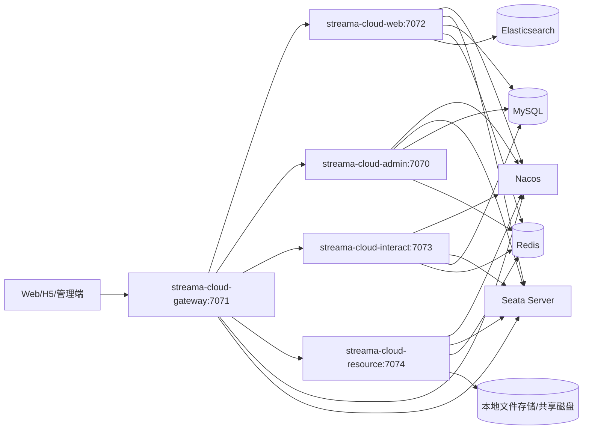
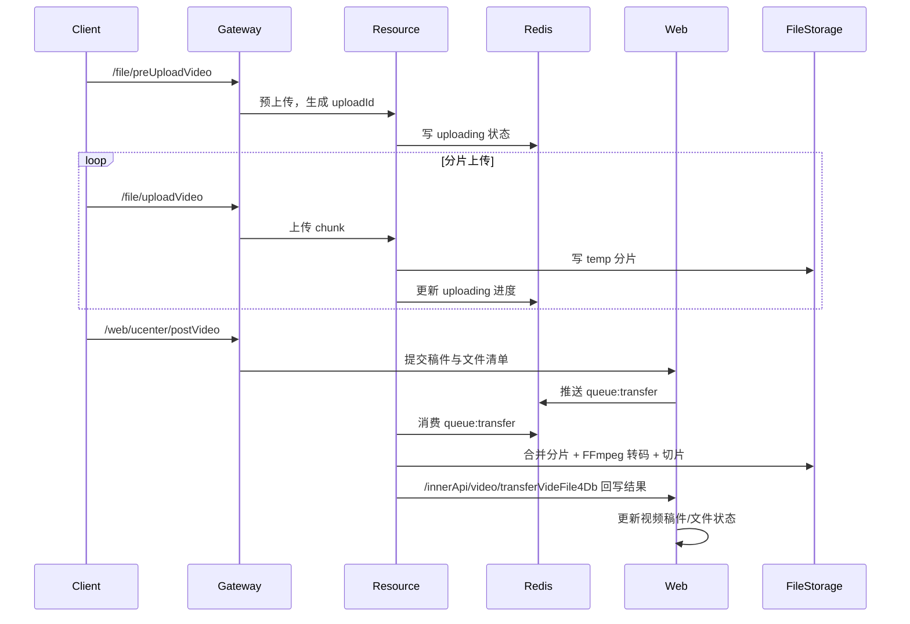

# Streama 系统架构设计（微服务版：Spring Cloud + Spring Cloud Alibaba）

## 1. 文档说明

### 1.1 目标

基于同级目录 `streama-cloud` 当前代码实现，输出可落地的微服务架构设计，指导开发、联调、部署与运维。

### 1.2 范围

- 服务划分与职责边界
- 服务间调用关系
- 数据与存储架构
- 分布式事务与一致性策略
- 部署拓扑与扩展建议

### 1.3 参考基线（代码现状）

- 基线时间：`2026-04-18`
- 代码目录：`../streama-cloud`
- 核心技术栈：
  - Java 17
  - Spring Boot `3.5.9`
  - Spring Cloud `2025.0.1`
  - Spring Cloud Alibaba `2025.0.0.0`
  - MyBatis `3.0.3`
  - Nacos（注册中心 + 配置中心）
  - Spring Cloud Gateway
  - OpenFeign + LoadBalancer
  - Seata（AT 模式）
  - Redis
  - Elasticsearch（`streama_video`）
  - MySQL 8
  - FFmpeg（视频转码）

## 2. 总体架构

## 3. 服务清单与职责

| 服务名 | 端口 | 网关前缀 | 核心职责 | 主要依赖 |
|---|---:|---|---|---|
| `streama-cloud-gateway` | 7071 | `/web` `/admin` `/interact` `/file` | API 统一入口、路由转发、内部接口拦截、管理端基础鉴权过滤 | Nacos、Gateway、LoadBalancer |
| `streama-cloud-web` | 7072 | `/web/**` | 用户、主页、视频信息、投稿、检索与推荐主业务 | MySQL、Redis、Elasticsearch、Feign(interact/admin)、Seata |
| `streama-cloud-admin` | 7070 | `/admin/**` | 管理端登录、分类管理、视频审核、管理侧资源访问代理 | MySQL、Redis、Feign(web/resource) |
| `streama-cloud-interact` | 7073 | `/interact/**` | 评论、弹幕、点赞/收藏/投币等行为域 | MySQL、Redis、Feign(web)、Seata |
| `streama-cloud-resource` | 7074 | `/file/**` | 图片上传、分片上传、视频转码、HLS 资源输出、播放事件入队 | 文件系统、Redis、FFmpeg、Feign(web) |
| `streama-cloud-common` | - | - | 公共能力：Redis、ES 配置、异常处理、基础 DTO/工具类 | - |
| `streama-cloud-base` | - | - | 常量、基础实体、枚举、异常等基础抽象 | - |

说明：
- `resource` 服务启动时排除了 `DataSourceAutoConfiguration`，不直接连数据库。
- 根 `pom.xml` 中 `streama-cloud-gateway` 模块出现了重复声明，建议后续清理避免构建歧义。

## 4. 网关路由与入口设计

网关静态路由（`application.yml`）：

- `/web/**` -> `lb://streama-cloud-web`
- `/admin/**` -> `lb://streama-cloud-admin`（附加 `AdminFilter`）
- `/file/**` -> `lb://streama-cloud-resource`
- `/interact/**` -> `lb://streama-cloud-interact`
- 全部使用 `StripPrefix=1`

网关治理规则：

- `GatewayGlobalRequestFilter`：拦截 `"/innerApi"` 前缀，防止内部 API 暴露到外网。
- `AdminFilter`：对 `/admin` 路径做管理令牌检查（账号相关放行，文件资源场景支持从 Cookie 获取 `adminToken`）。
- `GatewayExceptionHandler`：统一转换网关层异常响应结构。

## 5. 服务间调用关系（Feign）

| 调用方 | 被调方 | 用途 |
|---|---|---|
| `web` | `interact` | 查询用户行为、视频删除时联动删评论/弹幕 |
| `web` | `admin` | 获取分类树/分类列表 |
| `interact` | `web` | 查询视频与用户、更新计数、投币扣减与加币 |
| `resource` | `web` | 查询文件元数据、转码完成后回写视频文件状态 |
| `admin` | `web` | 审核列表、审核操作、统计查询 |
| `admin` | `resource` | 上传图片、资源读取/视频流读取代理 |

内部调用统一使用 `Constants.INNER_API_PREFIX = /innerApi` 前缀，通过网关进行外部隔离。

## 6. 数据架构设计

### 6.1 MySQL（单库逻辑分域）

当前为单库 `streama`，按业务域逻辑拆分表：

- 管理域：`category_info`
- 核心视频域：`video_info` `video_info_post` `video_info_file` `video_info_file_post`
- 用户域：`user_info` `user_focus`
- 互动域：`video_comment` `video_danmu` `user_action`
- 分布式事务：`undo_log`（Seata AT）

### 6.2 Redis（缓存 + 队列）

关键键空间（前缀 `streama:`）：

- 鉴权会话：`token:web:*` `token:admin:*`
- 验证码：`checkcode:*`
- 配置与缓存：`category:list` `sysSetting`
- 上传临时状态：`uploading:*`
- 异步队列：
  - `queue:transfer`（待转码文件队列）
  - `queue:video:play`（播放增量事件队列）
- 检索热词：`video:search:*`（ZSet）

### 6.3 Elasticsearch

- 索引：`streama_video`（可配置）
- 用途：视频搜索、排序、高亮、播放/弹幕/收藏计数辅助检索
- 写入策略：视频审核/更新后写 ES，播放事件异步更新 ES 计数

### 6.4 文件存储

当前使用本地/挂载目录（`project.folder/file`）：

- `cover/`：封面与图片
- `temp/`：上传分片临时目录
- `video/`：转码后正式目录（`.m3u8 + .ts`）

## 7. 关键业务链路

### 7.1 投稿与转码链路

### 7.2 播放计数链路

1. 客户端请求 `/file/videoResource/...` 播放视频。
2. `resource` 服务完成资源输出后，将播放事件写入 `Redis queue:video:play`。
3. `web` 服务后台线程消费该队列，更新：
   - MySQL `video_info.play_count`
   - Elasticsearch 对应文档计数

### 7.3 互动链路（评论/弹幕/点赞/收藏/投币）

- 入口在 `interact` 服务。
- 涉及跨服务数据更新时，通过 Feign 调 `web`（如视频计数、用户币更新）。
- 核心写操作在多个服务中使用 `@GlobalTransactional` 实现分布式事务一致性。

## 8. 事务与一致性设计

### 8.1 强一致（Seata AT）

典型场景：

- 投稿/审核状态流转涉及多表更新
- 互动行为导致跨域计数变化
- 投币行为涉及互动域与用户资产域

### 8.2 最终一致（异步队列）

适用场景：

- 视频转码完成回写
- 播放计数累加
- 文件删除延后处理

当前采用 Redis List 轮询消费，具备实现简单的优势；高并发场景建议演进至 MQ（RocketMQ/Kafka）增强可观测性与重试能力。

## 9. 配置中心与服务治理

### 9.1 Nacos 配置

各服务均使用：

- 注册：`spring.cloud.nacos.server-addr=127.0.0.1:8848`
- 配置导入：
  - `streama-cloud-admin-dev.yml`
  - `streama-cloud-web-dev.yml`
  - `streama-cloud-interact-dev.yml`
  - `streama-cloud-resource-dev.yml`
  - `streama-cloud-gateway-dev.yml`

### 9.2 Seata 配置

- 事务组：`default_tx_group`
- 注册/配置中心：Nacos
- 分组：`SEATA_GROUP`
- 配置项：`seataServer.properties`

## 10. 部署拓扑建议

### 10.1 开发/测试（单机）

- 网关 + 4 业务服务 + Nacos + Seata + MySQL + Redis + ES + FFmpeg
- 文件目录挂本地磁盘

### 10.2 生产（推荐）

- 网关、`web`、`interact`、`resource`、`admin` 全部多实例化
- Nacos、Redis、MySQL、ES 采用高可用集群
- 文件层改造为对象存储（MinIO/OSS）+ CDN
- 网关前置 LB（Nginx/SLB）

## 11. 非功能设计

### 11.1 性能

- 读多写少业务优先缓存（分类、系统配置、热词）
- 搜索与推荐流量优先走 ES
- 计数型写入通过队列削峰

### 11.2 可用性

- 服务注册发现 + 客户端负载均衡
- 异常统一封装，网关层统一错误出口
- 长链路异步解耦（上传转码、播放计数）

### 11.3 安全

- 网关阻断内部 API 直连（`/innerApi`）
- 管理端走独立令牌 `adminToken`
- 建议增加：
  - 网关限流与熔断（Sentinel）
  - 统一鉴权中间件（JWT/OAuth2）
  - 上传类型与内容安全扫描

### 11.4 可观测性

建议补齐：

- Trace（OpenTelemetry + SkyWalking/Jaeger）
- Metrics（Prometheus + Grafana）
- 日志聚合（ELK/Loki）
- 队列积压与转码失败告警

## 12. 演进路线（建议）

1. 将 Redis 轮询队列迁移为 RocketMQ/Kafka，增强可靠投递与回溯。
2. 文件存储从本地目录迁移至对象存储，降低 `resource` 节点状态性。
3. 数据库由“单库逻辑分域”逐步演进为“按服务拆库”。
4. 网关补齐统一限流、黑白名单、灰度发布能力。
5. 建立完整 SLO（可用性、延迟、转码成功率、搜索成功率）体系。

---

## 附录 A：模块与端口速查

| 模块 | 服务名 | 端口 |
|---|---|---:|
| streama-cloud-gateway | streama-cloud-gateway | 7071 |
| streama-cloud-admin | streama-cloud-admin | 7070 |
| streama-cloud-web | streama-cloud-web | 7072 |
| streama-cloud-interact | streama-cloud-interact | 7073 |
| streama-cloud-resource | streama-cloud-resource | 7074 |

## 附录 B：关键数据库表速查

| 业务域 | 表 |
|---|---|
| 分类管理 | `category_info` |
| 用户与关系 | `user_info`, `user_focus` |
| 视频主数据 | `video_info`, `video_info_post` |
| 视频文件 | `video_info_file`, `video_info_file_post` |
| 互动 | `video_comment`, `video_danmu`, `user_action` |
| 分布式事务 | `undo_log` |

