# 基于微服务架构的在线视频分享平台设计与实现论文目录大纲

## 第一章 绪论

### 1.1 研究背景与意义

随着移动互联网、5G 通信、云计算和智能终端设备的快速发展，在线视频已经成为互联网内容传播和用户娱乐消费的重要形式。以短视频、长视频、直播回放和用户自制内容为代表的视频内容不断增长，视频平台逐渐从单一的视频播放工具发展为集内容创作、社交互动、搜索推荐和内容治理于一体的综合型平台。用户不仅是视频内容的观看者，也是视频内容的生产者和传播者，评论、弹幕、点赞、收藏、投币、关注等交互方式进一步增强了平台的社区属性。

在线视频分享平台在带来丰富内容生态的同时，也对系统架构提出了更高要求。一方面，视频文件通常体积较大，上传、存储、转码、切片、播放等流程涉及大量计算和 I/O 操作，需要系统具备较好的处理能力和扩展能力；另一方面，平台需要支持用户登录、视频投稿、视频检索、互动行为、后台管理等多类业务，传统单体架构在功能扩展、模块维护和服务部署方面容易出现耦合度高、扩展困难、故障影响范围大等问题。因此，采用微服务架构对系统进行模块拆分，使不同业务服务能够独立开发、部署和扩展，具有较强的工程实践价值。

此外，随着用户生成内容数量的增加，平台内容安全问题也越来越突出。视频内容可能包含暴力、低俗、敏感言论或其他违规信息，仅依靠人工审核难以满足效率和实时性的要求。人工智能技术的发展，特别是语音识别、声音事件检测和多模态大模型的发展，为视频内容审核提供了新的技术方案。通过将 AI 审核服务与业务系统结合，可以在视频发布前对画面、语音文本和声音事件进行综合分析，给出风险等级和审核建议，再由管理员进行人工复核，从而形成“AI 初审 + 人工终审”的协同审核流程。

本课题设计并实现一个基于微服务架构的在线视频分享平台，系统面向普通用户、内容创作者和平台管理员，提供视频浏览、搜索、投稿、转码播放、互动评论、后台审核和 AI 智能审核等功能。课题的意义主要体现在三个方面：第一，通过 Spring Cloud Alibaba 等技术完成在线视频平台的微服务化设计，提高系统的可维护性和扩展性；第二，通过 FFmpeg、HLS、Redis、Elasticsearch、RabbitMQ 等技术实现视频处理、搜索和异步任务协同，提升系统工程完整性；第三，通过独立 Python AI 审核服务实现多模态内容审核，为视频平台内容安全治理提供可行的技术实践。

### 1.2 国内外研究现状

国外在线视频平台起步较早，YouTube、Netflix 等平台在视频分发、流媒体播放、内容推荐和系统架构方面积累了大量实践经验。其中，Netflix 是微服务架构较早的实践者之一，通过服务拆分、注册发现、网关路由和弹性伸缩等技术提高系统的可用性和扩展能力。随着云原生技术的发展，国外视频平台普遍采用微服务、容器化部署、分布式存储和内容分发网络等方式支撑大规模用户访问。与此同时，HLS、DASH 等自适应流媒体技术逐渐成熟，FFmpeg 等开源视频处理工具被广泛应用于视频转码、切片和格式转换等场景。

国内在线视频平台和短视频平台发展迅速，哔哩哔哩、抖音、快手等平台在用户创作、弹幕互动、视频推荐和社区运营方面形成了较成熟的业务模式。国内企业在后端架构上也广泛采用微服务和分布式技术，常见技术包括 Spring Cloud Alibaba、Dubbo、Nacos、Redis、消息队列和搜索引擎等。这些技术能够较好地解决业务模块复杂、访问量大、数据读写频繁和服务扩展困难等问题。在用户互动方面，弹幕、评论、点赞、收藏、投币等机制已经成为视频社区的重要组成部分。

在内容审核方面，国内外平台均逐渐从单纯依赖人工审核转向“机器审核 + 人工复核”的模式。传统审核方式主要依靠关键词匹配、图像分类模型或人工规则，能够处理部分简单违规内容，但面对复杂语义、音视频混合内容和隐蔽表达时存在局限。近年来，多模态人工智能技术快速发展，视频审核逐渐从单一的图像或文本检测扩展到画面、语音、文本和声音事件的综合分析。语音识别模型可以将视频中的语音转换为文本，声音事件检测模型可以识别异常声音，多模态大模型可以结合画面和文本进行语义判断，从而提升审核结果的准确性和解释性。

总体来看，当前在线视频平台相关技术已经较为成熟，但对于毕业设计项目而言，如何将微服务架构、视频处理、用户互动、搜索功能和 AI 审核服务整合为一个完整可运行的平台，仍具有较强的综合实践意义。本课题在现有技术基础上，结合 Spring Cloud Alibaba 微服务体系和 Python AI 审核服务，构建一个具备核心业务闭环的在线视频分享平台。

### 1.3 研究内容与目标

本课题围绕“基于微服务架构的在线视频分享平台设计与实现”展开，主要研究如何将在线视频分享平台中的用户管理、视频投稿、资源处理、互动行为、后台审核和 AI 内容审核等功能进行合理拆分与协同实现。系统整体采用前后端分离架构，前端包括普通用户端和后台管理端，后端采用 Spring Cloud Alibaba 微服务架构，AI 审核部分采用独立 Python 服务实现。

本课题的主要研究内容如下：

第一，完成在线视频分享平台的需求分析与总体架构设计。根据平台业务特点，将系统划分为网关服务、主站业务服务、后台管理服务、资源文件服务、互动服务、公共模块和基础模块等部分，并通过 Nacos、Gateway、OpenFeign 等技术实现服务注册、路由转发和服务间调用。

第二，实现视频投稿、上传、转码和播放链路。用户可以在创作中心上传视频和封面，填写视频标题、分类、标签、简介等投稿信息。系统通过分片上传降低大文件上传失败的影响，通过资源服务对视频进行合并、转码和 HLS 切片处理，并在转码完成后回写视频文件状态，为后续审核和播放提供基础。

第三，实现视频浏览、搜索和互动功能。用户可以在前台浏览视频列表，按照分类或关键词搜索视频，进入视频详情页进行播放，并进行评论、弹幕、点赞、收藏、投币、关注等操作。系统使用 Elasticsearch 支撑视频检索，使用 Redis 缓存部分热点数据和临时状态，提高访问效率。

第四，实现后台管理与人机协同审核流程。管理员可以在后台进行分类管理、视频审核和资源查看。视频完成转码后先进入待审核状态，AI 服务对视频进行自动审核并给出风险建议，管理员结合 AI 审核结果进行人工通过或驳回，审核通过后视频正式发布。

第五，实现独立的 AI 多模态审核服务。AI 服务通过 RabbitMQ 消费审核请求，下载待审核视频后执行音频提取、语音分段、声音事件检测、语音转写、关键帧抽取和多模态模型判断，并将审核建议、风险等级、风险标签、命中片段和关键帧截图等结果返回给 Java 后端。

本课题的目标是完成一个功能相对完整、架构清晰、流程闭环的在线视频分享平台原型。系统应能够展示微服务架构在复杂业务拆分中的应用，能够完成视频从上传到审核再到发布的核心流程，并能够通过 AI 审核服务提高视频内容审核的效率和辅助决策能力。

### 1.4 论文结构安排

本文围绕在线视频分享平台的设计与实现展开，全文共分为七章，各章内容安排如下：

第一章为绪论，主要介绍课题的研究背景与意义，分析国内外在线视频平台、微服务架构和 AI 内容审核的发展现状，明确本文的研究内容、研究目标和论文结构。

第二章为相关技术介绍，主要介绍系统开发中使用的关键技术，包括微服务架构与服务治理技术、前端开发技术、数据存储与缓存技术、视频处理技术、消息队列技术和 AI 多模态审核技术。

第三章为系统需求分析，主要从用户端、创作中心、管理端和 AI 审核等方面分析系统功能需求，并对系统的可扩展性、可维护性、内容安全、性能和可行性进行分析。

第四章为系统总体设计，主要介绍系统整体架构、微服务模块划分、服务调用关系、数据库设计、缓存与搜索设计、消息通信设计以及核心业务流程设计。

第五章为系统详细设计与实现，主要对用户端功能、视频上传转码播放、互动搜索、后台管理、AI 审核任务编排、多模态审核服务和人机协同审核等核心模块的设计与实现进行说明。

第六章为系统测试与结果分析，主要介绍测试环境和测试方案，对系统核心功能、视频处理流程、AI 审核流程和异常场景进行测试，并对测试结果进行分析。

第七章为总结与展望，主要总结本文完成的工作，分析项目的创新点与不足，并对后续系统优化方向进行展望。


## 第二章 相关技术介绍

### 2.1 微服务架构与服务治理技术

微服务架构是一种将复杂应用系统拆分为多个小型服务的架构思想。每个服务围绕相对独立的业务能力进行设计，拥有清晰的职责边界，并可以独立开发、部署和扩展。与传统单体架构相比，微服务架构能够降低系统模块之间的耦合度，提高系统的可维护性和扩展能力。当系统业务功能较多、访问压力较大或需要进行持续迭代时，微服务架构能够更好地支撑系统演进。

本系统是一个在线视频分享平台，涉及用户、视频、资源、互动、后台审核和 AI 审核等多个业务领域。如果采用单体架构，视频上传转码、用户互动、后台管理和 AI 审核等功能容易相互耦合，后续扩展和维护成本较高。因此，系统后端采用 Spring Cloud Alibaba 微服务技术体系，将不同业务拆分为相对独立的服务模块。系统主要包括网关服务、主站业务服务、后台管理服务、资源文件服务、互动服务、公共组件模块和基础实体模块，同时将 AI 审核能力设计为独立的 Python 微服务。

Spring Boot 是 Java 后端开发中常用的应用开发框架，能够简化 Spring 应用的配置和部署过程。Spring Cloud Alibaba 在 Spring Boot 的基础上提供了微服务治理相关能力，能够支持服务注册与发现、配置管理、网关路由、服务调用和分布式事务等功能。本系统使用 Nacos 作为注册中心和配置中心，各个微服务启动后将服务实例注册到 Nacos 中，其他服务可以通过服务名进行调用。Spring Cloud Gateway 作为系统统一入口，负责请求路由和基础过滤，将前端请求转发到对应业务服务。OpenFeign 用于服务之间的声明式调用，使服务间通信更加简洁。Seata 用于处理部分跨服务业务中的分布式事务问题，保证关键业务操作的数据一致性。

表 2-1 给出了本系统中微服务相关技术及其作用。

| 技术名称 | 主要作用 | 在本系统中的应用 |
| --- | --- | --- |
| Spring Boot | 快速构建 Java 后端服务 | 构建 web、admin、resource、interact 等业务服务 |
| Spring Cloud Alibaba | 微服务治理技术体系 | 提供注册发现、配置管理、服务治理等能力 |
| Nacos | 注册中心与配置中心 | 管理各微服务实例和服务配置 |
| Spring Cloud Gateway | API 网关 | 统一入口、路由转发、内部接口隔离 |
| OpenFeign | 服务间远程调用 | 实现 web、admin、resource、interact 等服务之间的调用 |
| Seata | 分布式事务 | 用于部分跨服务数据变更场景 |
| MyBatis | 数据持久层框架 | 完成 Java 对 MySQL 数据库的访问 |

通过上述技术，系统能够将不同业务能力拆分到独立服务中，降低模块间耦合度，并通过网关和服务治理组件完成统一访问、服务发现和内部协作。微服务架构也为后续系统扩展提供了基础，例如可以根据访问压力单独扩展资源服务或互动服务，也可以将 AI 审核服务部署在具备 GPU 能力的独立服务器上。

### 2.2 前端开发与交互技术

本系统采用前后端分离的开发方式，前端负责页面展示、用户交互和接口调用，后端负责业务处理和数据存储。前端项目分为普通用户端和后台管理端两部分，均基于 Vue3 技术栈开发。普通用户端主要面向视频浏览用户和内容创作者，提供首页浏览、搜索、播放、评论弹幕、投稿上传和个人中心等功能；后台管理端主要面向平台管理员，提供分类管理、视频审核、AI 审核结果查看等功能。

Vue3 是当前常用的渐进式 JavaScript 前端框架，具有组件化、响应式和开发效率高等特点。系统页面中的视频卡片、登录弹窗、评论区域、投稿表单、审核列表等均可以按照组件化思想进行组织，从而提高代码复用性和维护性。Vite 是前端构建工具，具备启动速度快、热更新效率高等特点，适合 Vue3 项目的开发调试。Element Plus 是基于 Vue3 的组件库，提供表单、表格、弹窗、按钮、分页、上传等常用组件，能够较快完成后台管理端和部分用户端页面的开发。

在状态管理方面，系统使用 Pinia 保存登录状态、用户信息等全局状态；使用 Vue Router 实现页面路由跳转；使用 Axios 统一封装 HTTP 请求，与后端网关或业务服务进行数据交互。在视频播放方面，系统结合 HLS.js 或 ArtPlayer 等播放器相关技术，实现浏览器端对 HLS 视频流的加载与播放。对于弹幕功能，前端需要将弹幕内容、时间点、颜色和模式等信息展示在播放器区域，并与后端弹幕接口配合完成弹幕发送和加载。

表 2-2 给出了前端主要技术及其作用。

| 技术名称 | 主要作用 | 在本系统中的应用 |
| --- | --- | --- |
| Vue3 | 前端页面开发框架 | 构建用户端和后台管理端页面 |
| Vite | 前端构建工具 | 提供开发服务器、热更新和项目打包 |
| Element Plus | UI 组件库 | 实现表单、表格、弹窗、分页等界面组件 |
| Pinia | 状态管理 | 维护用户登录状态和管理端状态 |
| Vue Router | 前端路由 | 实现首页、播放页、创作中心、后台页面跳转 |
| Axios | HTTP 请求工具 | 调用后端接口并统一处理响应 |
| HLS.js / ArtPlayer | 视频播放相关技术 | 播放 HLS 视频流并支持弹幕展示 |

通过前端相关技术的组合，系统能够实现较完整的用户交互体验。普通用户可以在浏览器中完成注册登录、浏览视频、观看视频、发表评论弹幕和上传视频等操作，管理员也可以通过后台页面完成分类管理和视频审核操作。

### 2.3 数据存储、缓存与搜索技术

在线视频分享平台涉及的数据类型较多，包括用户信息、视频信息、投稿信息、分类信息、视频文件信息、评论弹幕、用户行为、AI 审核任务和审核结果等。不同类型的数据在访问频率、结构化程度和查询方式上存在差异，因此系统采用 MySQL、Redis 和 Elasticsearch 组合完成数据存储、缓存和搜索。

MySQL 是关系型数据库，适合存储结构化业务数据。本系统使用 MySQL 保存用户信息、分类信息、视频主表、投稿表、视频文件表、评论表、弹幕表、用户行为表、AI 审核任务表和审核明细表等核心数据。通过关系型表结构，可以较好地表达用户、视频、文件、评论和审核任务之间的关系。系统后端通过 MyBatis 完成实体对象与数据库表之间的映射，并通过 Mapper 文件编写 SQL 查询和更新逻辑。

Redis 是基于内存的数据存储系统，具有访问速度快、数据结构丰富等特点。本系统中 Redis 主要用于缓存和轻量级异步队列场景。例如，登录 Token、验证码、系统配置、视频分类缓存、上传临时状态和搜索热词等数据适合存储在 Redis 中。对于视频转码等异步处理流程，系统也可以使用 Redis List 保存待处理任务，由资源服务后台线程进行消费，从而实现业务流程的解耦。

Elasticsearch 是面向全文检索和复杂查询的搜索引擎，适合用于视频标题、简介、标签等文本内容的搜索。本系统在视频审核通过后将视频信息写入 Elasticsearch 索引，用户搜索视频时可以根据关键词进行匹配，并支持按照播放量、发布时间、弹幕量、收藏量等条件进行排序。与直接使用 MySQL 模糊查询相比，Elasticsearch 在全文检索、相关性排序和搜索扩展方面更适合视频搜索场景。

表 2-3 展示了系统中数据相关技术的应用。

| 技术名称 | 数据类型 | 主要用途 |
| --- | --- | --- |
| MySQL | 结构化业务数据 | 保存用户、视频、投稿、评论、弹幕、审核任务等核心数据 |
| Redis | 缓存数据、临时状态、队列数据 | 保存 Token、验证码、上传进度、系统配置、热词和转码队列 |
| Elasticsearch | 搜索索引数据 | 支持视频标题、简介、标签等内容的全文检索 |
| MyBatis | 持久层映射 | 实现 Java 对 MySQL 表的查询、插入、更新和删除 |

上述数据技术各自承担不同职责。MySQL 保证核心业务数据的可靠存储，Redis 提升热点数据访问效率并支持部分异步处理，Elasticsearch 提供更适合视频检索的全文搜索能力。通过多种数据技术的组合，系统能够同时满足业务数据存储、快速访问和视频检索的需求。

### 2.4 视频处理、消息队列与 AI 审核技术

视频处理是在线视频分享平台的核心技术之一。用户上传的原始视频通常格式、码率、分辨率和文件大小各不相同，直接播放可能会出现兼容性和加载效率问题。因此，系统需要在视频上传后进行统一处理。本系统使用 FFmpeg 对上传视频进行合并、转码和切片处理，将视频转换为适合网页播放的 HLS 格式。HLS 视频通常由一个 `.m3u8` 索引文件和多个 `.ts` 切片文件组成，浏览器播放器可以按需加载切片，从而提高播放稳定性和兼容性。

消息队列用于解决系统中的异步任务处理问题。在线视频平台中，视频转码和 AI 审核都属于耗时操作，如果在用户请求过程中同步执行，会导致接口响应时间过长，影响用户体验。因此，系统通过异步任务方式处理耗时流程。视频投稿后，系统将待转码文件写入队列，由资源服务后台处理；视频转码完成后，后端创建 AI 审核任务，并通过 RabbitMQ 发送审核请求。AI 服务消费审核请求后执行多模态审核，完成后再通过 RabbitMQ 将审核结果返回给后端。通过消息队列，系统能够实现服务之间的解耦，并提高长流程任务的可靠性和可扩展性。

AI 审核服务是本系统的重要组成部分。该服务使用 Python 技术栈实现，作为独立微服务运行，并通过 RabbitMQ 与 Java 后端进行通信。AI 审核流程不是只判断单一画面，而是对视频中的多种信息进行综合分析。首先，服务使用 FFmpeg 从视频中提取音频；然后使用 VAD 技术进行语音活动检测，将音频划分为语音片段；接着使用 Whisper 对语音内容进行转写，得到文本信息；同时使用 YAMNet 对音频中的声音事件进行识别，例如尖叫、爆炸、警报等风险声音；之后从视频中抽取关键帧，并将关键帧、语音文本和声音信息交给 Qwen 多模态模型进行综合判断。最终，AI 服务输出视频级审核建议、风险等级、风险标签、命中片段、原因说明和关键帧截图路径。

图 2-1 展示了本系统关键技术之间的关系。

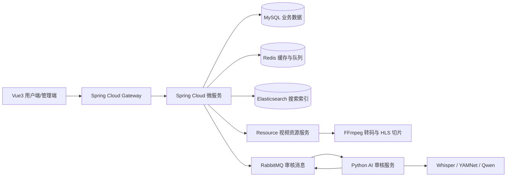

图 2-1 系统关键技术关系示意图

表 2-4 给出了视频处理、消息队列和 AI 审核相关技术的作用。

| 技术名称 | 主要作用 | 在本系统中的应用 |
| --- | --- | --- |
| FFmpeg | 音视频处理工具 | 视频合并、转码、切片、音频提取 |
| HLS | 流媒体播放协议 | 将视频拆分为 `.m3u8` 与 `.ts` 文件供浏览器播放 |
| RabbitMQ | 消息队列 | 发送 AI 审核请求、接收 AI 审核结果 |
| FastAPI | Python Web 框架 | 构建 AI 审核服务健康检查和服务入口 |
| Whisper | 语音识别模型 | 将视频语音内容转换为文本 |
| YAMNet | 声音事件检测模型 | 检测视频中可能存在的风险声音事件 |
| Qwen 多模态模型 | 多模态内容理解 | 结合画面、文本和声音信息判断视频风险 |

本系统通过视频处理、消息队列和 AI 审核技术的结合，完成了从视频上传到转码播放，再到智能审核和人工复核的业务闭环。FFmpeg 和 HLS 保证了视频资源可以在网页端稳定播放，RabbitMQ 保证了 Java 后端与 Python AI 服务之间的异步协作，Whisper、YAMNet 和 Qwen 多模态模型则为视频内容安全审核提供了技术基础。


## 第三章 系统需求分析

### 3.1 系统总体需求分析

本课题旨在设计并实现一个基于微服务架构的在线视频分享平台。系统需要围绕视频内容的生产、处理、分发、互动、审核形成完整业务闭环。普通用户可以浏览、搜索、播放视频，并参与评论、弹幕、点赞、收藏、投币等互动；内容创作者可以上传视频、编辑稿件和管理个人作品；管理员可以在后台进行分类管理、视频审核和系统内容治理；AI 审核服务则作为独立能力服务，对上传视频进行自动化风险识别，为人工审核提供辅助决策。

从整体功能上看，系统应满足以下几方面需求。第一，系统需要提供稳定的视频分享基础功能，包括用户注册登录、视频列表展示、视频详情播放、视频搜索和相关推荐等。第二，系统需要支持创作者完成视频投稿流程，包括封面上传、视频分片上传、投稿信息填写、视频转码和投稿状态查看。第三，系统需要提供社区互动能力，包括评论、弹幕、点赞、收藏、投币和关注等功能，增强平台的内容社区属性。第四，系统需要提供后台管理能力，使管理员能够维护分类数据、查看待审核视频、结合 AI 审核结果进行人工审核。第五，系统需要提供 AI 智能审核能力，在视频正式发布前对视频画面、语音文本和声音事件进行综合分析，输出审核建议、风险等级和命中片段等信息。

系统主要参与角色包括游客、注册用户、内容创作者、管理员和 AI 审核服务。其中，游客可以浏览和搜索公开视频；注册用户在登录后可以参与互动；内容创作者是注册用户中的投稿者，可以上传和管理自己的视频；管理员负责后台内容管理和视频审核；AI 审核服务通过消息队列自动处理待审核视频。系统角色与主要功能关系如图 3-1 所示。

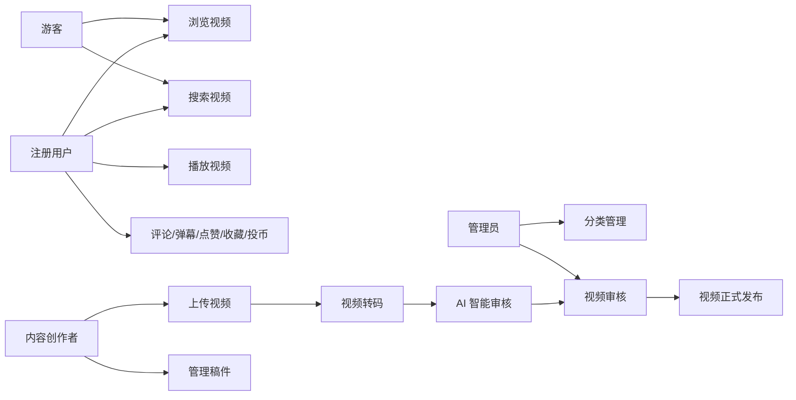

图 3-1 系统角色与功能用例示意图

表 3-1 展示了系统主要角色及其功能需求。

| 角色 | 主要功能需求 | 说明 |
| --- | --- | --- |
| 游客 | 浏览视频、搜索视频、查看公开视频信息 | 未登录用户可进行基础访问 |
| 注册用户 | 登录、播放视频、评论、弹幕、点赞、收藏、投币、关注 | 登录后可参与平台互动 |
| 内容创作者 | 上传视频、编辑投稿、查看稿件状态、管理作品 | 负责视频内容创作与发布 |
| 管理员 | 登录后台、分类管理、视频审核、查看 AI 审核结果 | 负责平台内容管理与审核 |
| AI 审核服务 | 消费审核任务、分析视频、返回审核结果 | 为管理员审核提供辅助依据 |

系统整体目标不是单一实现视频播放功能，而是围绕“上传、转码、审核、发布、播放、互动、管理”构建完整平台流程。该需求与任务书中提出的“构建从内容创作到社区互动的完整闭环，引入独立 AI 智能审核服务，提高审核效率与内容安全性”的要求一致。

### 3.2 用户端与创作中心功能需求分析

用户端是普通用户访问系统的主要入口，主要承担视频浏览、视频搜索、视频播放和社区互动等功能。用户进入平台后，可以查看首页推荐视频列表，也可以按照分类或关键词检索视频内容。视频详情页需要展示视频标题、封面、简介、分类、标签、播放量、点赞数、收藏数、评论数等信息，并提供视频播放、分 P 切换、相关推荐和互动入口。

用户注册登录是用户端的基础功能。系统需要支持邮箱注册、验证码校验、密码登录、自动登录和退出登录等操作。登录后，用户可以进行点赞、收藏、投币、评论、发送弹幕、关注其他用户等操作；未登录用户只能进行浏览和搜索等基础访问，涉及个人行为的数据操作需要引导登录。

视频播放功能是用户端的核心功能之一。由于系统中的视频经过 FFmpeg 转码并生成 HLS 文件，因此前端需要能够加载 `.m3u8` 索引文件并播放对应的视频切片。播放页还需要支持弹幕展示和弹幕发送，用户发送的弹幕应包含视频编号、分 P 文件编号、播放时间点、弹幕内容、颜色和模式等信息。评论功能需要支持一级评论和回复，用户也可以对评论进行点赞或点踩。

创作中心面向内容创作者，主要负责视频投稿和作品管理。创作者可以上传视频封面，选择视频分类，填写标题、标签、简介、投稿类型和互动设置，并上传一个或多个视频文件。考虑到视频文件体积较大，系统需要支持分片上传，避免大文件上传失败后需要重新上传全部内容。视频上传完成后，创作者提交投稿信息，系统将视频保存为投稿态数据，并进入后续转码和审核流程。创作者还可以查看自己的稿件列表，了解视频处于转码中、转码失败、待审核、审核通过或审核不通过等状态。

表 3-2 展示了用户端与创作中心的主要功能需求。

| 功能模块 | 功能点 | 需求说明 |
| --- | --- | --- |
| 账号功能 | 注册、登录、自动登录、退出 | 支持用户身份认证和登录状态维护 |
| 视频浏览 | 首页列表、分类筛选、视频详情 | 用户可以浏览平台公开视频内容 |
| 视频搜索 | 关键词搜索、热词展示、排序 | 支持根据标题、简介、标签等内容检索视频 |
| 视频播放 | HLS 播放、分 P 切换、相关推荐 | 支持转码后视频的在线播放 |
| 社区互动 | 评论、弹幕、点赞、收藏、投币、关注 | 增强用户参与感和社区属性 |
| 创作中心 | 封面上传、视频分片上传、稿件编辑、状态查看 | 支持用户进行视频投稿和作品管理 |

从业务流程上看，用户端与创作中心的功能并不是相互独立的。创作者上传视频后，视频需要经过资源服务转码、AI 审核和管理员审核后才能进入正式视频列表；正式发布后，普通用户才能在前台浏览、搜索和播放该视频。因此，用户端功能需要与后台审核和资源处理流程保持一致。

### 3.3 管理端与 AI 审核需求分析

管理端主要面向平台管理员，用于维护平台基础数据和处理视频审核任务。根据任务书和开题报告中的要求，平台需要形成“AI 智能审核 + 人工处理”的人机协同审核流程。因此，管理端不仅需要支持传统的视频审核操作，还需要展示 AI 审核服务返回的风险信息，使管理员能够更高效地判断视频是否可以发布。

管理端首先需要具备管理员登录功能，管理员通过账号、密码和验证码进入后台系统。进入后台后，管理员可以进行分类管理，包括新增分类、编辑分类、删除分类和调整分类顺序等。分类数据会影响用户投稿时的视频分类选择，也会影响前台首页或分类页的视频展示，因此分类管理是平台内容组织的重要基础。

视频审核是管理端的核心功能。视频投稿后会先保存到投稿表中，资源服务完成转码后，稿件进入待审核状态。管理员需要能够查看待审核视频列表，列表中应展示视频封面、标题、投稿用户、分类、投稿时间、视频状态、播放统计信息和 AI 审核摘要等内容。管理员可以进入审核详情查看视频内容和 AI 审核明细，并根据系统提示进行人工通过或驳回操作。审核通过后，系统需要将投稿态数据迁移到正式视频表中，并写入搜索索引；审核驳回后，投稿状态变更为审核不通过。

AI 审核服务的需求主要体现在审核任务自动触发、视频内容多模态分析和审核结果结构化返回三个方面。当视频转码完成后，Java 后端应自动创建 AI 审核任务，并通过 RabbitMQ 发送审核请求。AI 服务收到请求后，需要下载待审视频，提取音频、转写语音、抽取关键帧并进行多模态风险判断。审核完成后，AI 服务应返回视频级和分文件级结果，包括审核建议、风险等级、风险分值、风险标签、命中时间段、命中原因和关键帧截图路径等信息。Java 后端消费审核结果后，需要将结果写入 `ai_audit_task` 和 `ai_audit_task_item` 等表中，供管理端查询和展示。

表 3-3 展示了管理端与 AI 审核功能需求。

| 功能模块 | 功能点 | 需求说明 |
| --- | --- | --- |
| 管理员认证 | 后台登录、退出登录、权限校验 | 保证后台管理功能只对管理员开放 |
| 分类管理 | 分类新增、编辑、删除、排序 | 维护平台视频分类体系 |
| 视频审核列表 | 待审核视频查询、状态筛选、用户信息展示 | 管理员查看投稿视频状态 |
| 视频人工审核 | 审核通过、审核驳回、资源预览 | 管理员对视频发布进行最终决策 |
| AI 审核任务 | 自动创建任务、投递审核请求、接收审核结果 | 实现视频审核流程自动化辅助 |
| AI 审核展示 | 风险等级、审核建议、命中片段、截图路径 | 为管理员判断风险内容提供依据 |

为了保证审核流程清晰，系统中视频状态需要明确流转。投稿视频从用户提交开始，依次经历转码中、转码失败、待审核、审核通过或审核不通过等状态。AI 审核结果不直接决定视频最终发布，而是作为管理员人工审核的重要参考。这样既可以提高审核效率，也可以避免 AI 模型误判直接影响内容发布。

图 3-2 展示了视频投稿与审核状态流转过程。

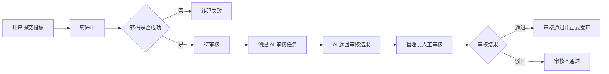

图 3-2 视频投稿与审核状态流转图

### 3.4 非功能需求与可行性分析

除功能需求外，系统还需要满足一定的非功能需求。在线视频分享平台涉及用户访问、视频文件处理、搜索查询、异步审核和后台管理等多类场景，如果仅关注功能实现而忽略系统性能、可靠性和可维护性，后续系统运行和扩展都会受到影响。因此，本系统需要从性能、可扩展性、可用性、安全性、数据一致性和可维护性等方面进行分析。

在性能方面，系统需要保证常见用户操作具有较好的响应速度，例如登录、视频列表加载、视频详情查询、评论加载和搜索查询等。对于视频上传、转码和 AI 审核等耗时操作，应采用异步处理方式，避免阻塞用户请求。在可扩展性方面，系统采用微服务架构，可以根据业务压力单独扩展资源服务、互动服务或 AI 审核服务。在可用性方面，系统需要对转码失败、AI 审核失败、消息重复投递等异常情况进行处理，保证核心业务流程不中断。

在安全性方面，系统需要对用户登录状态、管理员登录状态和内部接口访问进行控制。普通用户和管理员应使用不同的登录态标识，后台管理接口需要进行管理员身份校验，内部接口不应直接暴露给外部访问。在数据一致性方面，系统需要重点保证视频投稿、视频文件状态、审核状态和正式发布数据之间的一致性。对于跨服务操作，可以结合分布式事务和最终一致性策略实现。对于 AI 审核失败等情况，应允许系统降级为人工复核，以保证业务流程继续进行。

表 3-4 展示了系统主要非功能需求。

| 非功能需求 | 需求说明 | 实现思路 |
| --- | --- | --- |
| 性能需求 | 常规页面和接口响应应保持流畅 | 使用 Redis 缓存、Elasticsearch 搜索、异步任务处理 |
| 可扩展性 | 系统应便于后续增加功能和扩展服务 | 采用微服务架构，按业务模块拆分服务 |
| 可用性 | 异常情况下系统核心流程应尽量不中断 | 转码失败记录状态，AI 失败转人工复核 |
| 安全性 | 区分普通用户和管理员权限，保护内部接口 | 使用 Token、adminToken、网关过滤和内部接口隔离 |
| 数据一致性 | 投稿、转码、审核、发布状态应保持一致 | 使用事务控制、状态流转和异步结果回写 |
| 可维护性 | 系统结构清晰，便于后续修改和扩展 | 前后端分离，公共模块复用，接口文档化 |

从技术可行性来看，本系统所采用的 Spring Boot、Spring Cloud Alibaba、Vue3、MySQL、Redis、Elasticsearch、RabbitMQ、FFmpeg 和 Python AI 模型等技术均较为成熟，具有较多的学习资料和工程实践案例，能够支撑毕业设计原型系统的实现。从经济可行性来看，系统开发主要基于开源技术和本地开发环境，不需要额外的软件授权成本。从操作可行性来看，系统面向普通用户和管理员提供 Web 页面，用户可以通过浏览器完成视频浏览、投稿和审核操作，使用方式较为直观。

综上所述，本系统在技术、经济和操作层面均具有可行性。通过合理的微服务划分、异步任务设计和 AI 审核服务集成，系统能够满足任务书中提出的在线视频分享、社区互动、后台管理和智能审核等核心需求。


## 第四章 系统总体设计

### 4.1 系统总体架构设计

本系统采用前后端分离与微服务相结合的总体架构。前端分为普通用户端和后台管理端，普通用户端主要负责视频浏览、搜索、播放、投稿和互动，后台管理端主要负责分类管理、视频审核和 AI 审核结果查看。后端采用 Spring Cloud Alibaba 微服务架构，按照业务职责拆分为网关服务、主站业务服务、后台管理服务、资源文件服务、互动服务、公共组件模块和基础模块。AI 审核服务使用 Python 技术栈独立实现，通过 RabbitMQ 与 Java 后端进行异步通信。

系统整体架构如图 4-1 所示。外部请求首先进入 `streama-cloud-gateway`，网关根据请求路径将请求转发到对应服务。用户端业务主要进入 `streama-cloud-web`、`streama-cloud-resource` 和 `streama-cloud-interact`；管理端业务主要进入 `streama-cloud-admin`。各业务服务通过 Nacos 完成注册发现，通过 OpenFeign 完成服务间调用。MySQL 用于保存核心业务数据，Redis 用于缓存、登录态、上传状态和部分异步队列，Elasticsearch 用于视频全文检索，RabbitMQ 用于 AI 审核请求和结果回传，文件系统用于保存封面、视频切片和审核截图。

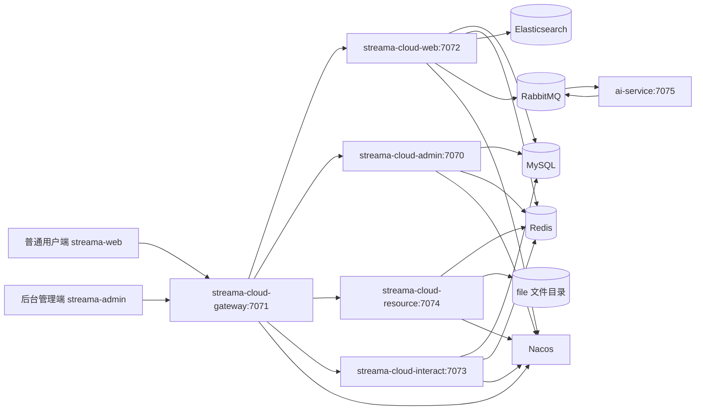

图 4-1 系统总体架构图

从架构层次上看，系统可以分为表现层、网关层、业务服务层、AI 能力层和数据存储层。表现层由 Vue3 前端项目组成；网关层提供统一入口和路由控制；业务服务层完成用户、视频、资源、互动和管理业务；AI 能力层负责多模态审核；数据存储层则由 MySQL、Redis、Elasticsearch、RabbitMQ 和本地文件目录组成。各层职责如表 4-1 所示。

| 架构层次 | 组成部分 | 主要职责 |
| --- | --- | --- |
| 表现层 | `streama-web`、`streama-admin` | 提供用户端和管理端页面，完成页面交互与接口调用 |
| 网关层 | `streama-cloud-gateway` | 统一入口、路由转发、管理端过滤、内部接口隔离 |
| 业务服务层 | `web`、`admin`、`resource`、`interact` | 实现用户、视频、文件、互动和后台管理业务 |
| AI 能力层 | `ai-service` | 消费审核任务，执行多模态审核并返回审核结果 |
| 数据存储层 | MySQL、Redis、Elasticsearch、RabbitMQ、文件目录 | 保存业务数据、缓存、搜索索引、消息和视频资源 |

系统网关的实际路由配置如代码 4-1 所示。可以看到，系统按照 `/web`、`/admin`、`/file`、`/interact` 四类路径将请求转发到对应微服务，并使用 `StripPrefix=1` 去掉网关前缀，使业务服务内部仍按照自身 Controller 路径处理请求。

```yaml
# 代码 4-1 网关核心路由配置
spring:
  cloud:
    gateway:
      routes:
        - id: web
          uri: lb://streama-cloud-web
          predicates:
            - Path=/web/**
          filters:
            - StripPrefix=1

        - id: admin
          uri: lb://streama-cloud-admin
          predicates:
            - Path=/admin/**
          filters:
            - StripPrefix=1
            - AdminFilter

        - id: resource
          uri: lb://streama-cloud-resource
          predicates:
            - Path=/file/**
          filters:
            - StripPrefix=1

        - id: interact
          uri: lb://streama-cloud-interact
          predicates:
            - Path=/interact/**
          filters:
            - StripPrefix=1
```

为了防止内部接口被外部直接访问，系统在网关中设置了全局过滤器，对包含 `/innerApi` 的路径直接返回异常。该设计保证服务间内部调用只能通过服务内部 Feign 客户端完成，减少内部接口暴露风险。

```java
// 代码 4-2 网关内部接口隔离核心代码
public Mono<Void> filter(ServerWebExchange exchange, GatewayFilterChain chain) {
    String rawpath = exchange.getRequest().getURI().getRawPath();
    if(rawpath.contains(Constants.INNER_API_PREFIX)) {
        return Mono.error(new BusinessException(ResponseCodeEnum.CODE_404));
    }
    return chain.filter(exchange);
}
```

### 4.2 微服务模块与调用关系设计

根据系统功能需求，后端微服务按照业务领域进行拆分。拆分原则是将高内聚、低耦合的功能放在同一服务中，将资源处理、互动行为、后台审核和主站业务等变化频率不同的模块分开，便于后续维护和扩展。系统当前后端模块及职责如表 4-2 所示。

| 模块名称 | 服务名/端口 | 网关前缀 | 主要职责 |
| --- | --- | --- | --- |
| `streama-cloud-gateway` | 7071 | - | API 统一入口、路由转发、内部接口隔离、管理端过滤 |
| `streama-cloud-web` | 7072 | `/web` | 用户、首页、视频信息、投稿、搜索推荐、AI 审核任务编排 |
| `streama-cloud-admin` | 7070 | `/admin` | 管理端登录、分类管理、视频审核、AI 审核结果代理查询 |
| `streama-cloud-resource` | 7074 | `/file` | 图片上传、视频分片上传、视频转码、HLS 资源输出 |
| `streama-cloud-interact` | 7073 | `/interact` | 评论、弹幕、点赞、收藏、投币等互动行为 |
| `streama-cloud-common` | - | - | Redis、ES、异常处理、公共组件和工具类 |
| `streama-cloud-base` | - | - | 常量、枚举、基础实体、查询对象和公共 DTO |
| `ai-service` | 7075 | - | RabbitMQ 消费审核任务，执行 AI 多模态审核并回传结果 |

各服务之间不是简单的单向调用，而是围绕具体业务场景协作。例如，用户提交投稿信息时，`web` 服务负责保存投稿主数据和分 P 文件数据，并将待转码文件放入 Redis 队列；`resource` 服务消费队列后完成视频转码，并通过 Feign 调用 `web` 服务内部接口回写转码结果；当视频全部转码成功后，`web` 服务创建 AI 审核任务并发送 RabbitMQ 消息；AI 服务审核完成后将结果发回 RabbitMQ，由 `web` 服务消费并落库；管理员在后台审核时，`admin` 服务通过 Feign 调用 `web` 服务完成审核操作。

系统主要服务调用关系如表 4-3 所示。

| 调用方 | 被调用方 | 调用方式 | 主要用途 |
| --- | --- | --- | --- |
| `gateway` | `web/admin/resource/interact` | Gateway 路由 | 将外部请求转发到对应服务 |
| `web` | `admin` | OpenFeign | 获取分类树和分类列表 |
| `web` | `interact` | OpenFeign | 查询用户行为、删除视频时联动删除评论弹幕 |
| `interact` | `web` | OpenFeign | 查询视频和用户信息，更新视频计数和用户硬币 |
| `resource` | `web` | OpenFeign | 查询文件信息，转码完成后回写文件状态 |
| `admin` | `web` | OpenFeign | 查询审核列表、执行人工审核、查询 AI 审核结果 |
| `admin` | `resource` | OpenFeign | 上传图片、读取封面和视频资源 |
| `web` | `ai-service` | RabbitMQ | 发送 AI 审核请求、接收 AI 审核结果 |

服务内部调用统一使用 `/innerApi` 作为内部接口前缀。该前缀定义在公共常量中，网关过滤器会拦截外部访问，因此外部用户无法直接调用内部接口。系统中的关键常量如代码 4-3 所示。

```java
// 代码 4-3 系统关键常量设计
public static final String REDIS_KEY_PREFIX = "streama:";
public static final String REDIS_KEY_TOKEN_WEB = REDIS_KEY_PREFIX + "token:web:";
public static final String REDIS_KEY_TOKEN_ADMIN = REDIS_KEY_PREFIX + "token:admin:";
public static final String REDIS_KEY_UPLOADING_FILE = REDIS_KEY_PREFIX + "uploading:";
public static final String REDIS_KEY_QUEUE_TRANSFER = REDIS_KEY_PREFIX + "queue:transfer:";
public static final String REDIS_KEY_QUEUE_VIDEO_PLAY = REDIS_KEY_PREFIX + "queue:video:play:";
public static final String INNER_API_PREFIX = "/innerApi";
public static final String RABBIT_AUDIT_EXCHANGE = "streama.audit.exchange";
public static final String RABBIT_AUDIT_REQUEST_QUEUE = "streama.audit.request.queue";
public static final String RABBIT_AUDIT_REQUEST_ROUTING_KEY = "audit.video.request";
public static final String RABBIT_AUDIT_RESULT_QUEUE = "streama.audit.result.queue";
public static final String RABBIT_AUDIT_RESULT_ROUTING_KEY = "audit.video.result";
```

从模块设计上看，`web` 服务是主业务中心，负责视频投稿、视频正式数据、AI 审核任务和搜索索引写入；`resource` 服务专注于文件和视频处理，不直接连接数据库，而是通过 Redis 和 Feign 与其他服务协作；`interact` 服务独立处理互动行为，避免评论、弹幕、点赞等高频行为与主视频业务过度耦合；`admin` 服务作为后台入口，主要负责管理端接口编排和审核操作代理。这样的拆分方式符合在线视频平台中“主业务、文件处理、互动行为、后台管理、AI 能力”分离的设计目标。

### 4.3 数据库、缓存与搜索设计

系统的数据设计采用“单库逻辑分域”的方式，即当前所有业务表存放在同一个 MySQL 数据库中，但按照业务领域划分为用户域、视频域、投稿域、互动域、审核域和管理域。这样既便于毕业设计阶段开发和部署，也能体现微服务业务边界。后续如果系统规模扩大，可以再按照服务边界演进为分库设计。

核心数据库表及作用如表 4-4 所示。

| 业务域 | 数据表 | 主要作用 |
| --- | --- | --- |
| 分类管理 | `category_info` | 保存视频一级/二级分类、分类编码、图标和排序 |
| 用户域 | `user_info`、`user_focus` | 保存用户基础信息、登录相关信息和关注关系 |
| 视频正式数据 | `video_info`、`video_info_file` | 保存审核通过后正式发布的视频主信息和分 P 文件信息 |
| 投稿数据 | `video_info_post`、`video_info_file_post` | 保存投稿态视频、转码状态、待审核状态和分 P 文件处理结果 |
| 互动数据 | `video_comment`、`video_danmu`、`user_action` | 保存评论、弹幕、点赞、收藏、投币等用户行为 |
| AI 审核数据 | `ai_audit_task`、`ai_audit_task_item` | 保存 AI 审核任务、审核版本、风险等级、命中标签和命中片段 |
| 分布式事务 | `undo_log` | 保存 Seata AT 模式下的回滚日志 |

视频数据表采用“投稿表”和“正式表”分离的设计。用户提交或编辑视频后，数据先进入 `video_info_post` 和 `video_info_file_post`。其中，`video_info_post.status` 表示投稿主状态，取值包括转码中、转码失败、待审核、审核通过、审核不通过；`video_info_file_post.transfer_result` 表示分 P 文件转码状态。只有管理员审核通过后，系统才会将投稿表中的数据复制到 `video_info` 和 `video_info_file`，并写入 Elasticsearch 索引。该设计可以避免未审核内容直接进入正式视频列表。

AI 审核表采用主从结构。`ai_audit_task` 保存视频级审核任务，包括 `request_id`、`video_id`、`audit_version`、`task_status`、`ai_decision`、`ai_risk_level`、`ai_summary` 等字段；`ai_audit_task_item` 保存分 P 级审核结果，包括 `file_id`、`risk_score`、`risk_tags_json`、`hit_segments_json` 和 `item_reason` 等字段。该设计既能保存整条视频的综合结论，也能保留每个分 P 文件的风险细节，便于后台展示。

图 4-2 展示了系统核心表之间的关系。

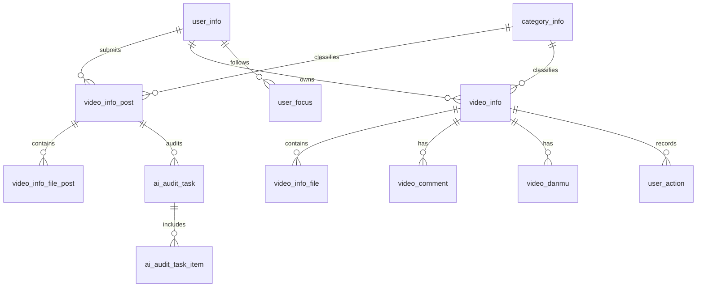

图 4-2 核心数据表关系图

Redis 主要承担缓存、登录态、临时上传状态和轻量队列功能。系统实际定义的 Redis 键空间如表 4-5 所示。

| Redis 键 | 数据含义 | 使用场景 |
| --- | --- | --- |
| `streama:checkcode:*` | 验证码 | 用户端和管理端登录注册校验 |
| `streama:token:web:*` | 普通用户登录态 | 普通用户认证与自动登录 |
| `streama:token:admin:*` | 管理员登录态 | 管理端认证 |
| `streama:category:list:` | 分类缓存 | 前台分类展示和投稿分类选择 |
| `streama:uploading:*` | 上传临时状态 | 保存 uploadId、分片数量、上传进度和临时路径 |
| `streama:file:list:del:*` | 待删除文件队列 | 编辑视频后延迟删除旧文件 |
| `streama:queue:transfer:` | 待转码文件队列 | resource 服务消费后执行转码 |
| `streama:queue:video:play:` | 播放计数队列 | 异步累加播放量 |
| `streama:video:search:` | 搜索热词 ZSet | 统计搜索关键词热度 |

搜索功能使用 Elasticsearch 完成，默认索引名称为 `streama_video`。视频审核通过或更新后，系统将视频标题、标签、简介、分类、播放数、弹幕数、收藏数等信息写入索引。用户执行搜索时，系统优先查询 Elasticsearch，以支持关键词检索、排序和推荐列表。MySQL 保存权威业务数据，Elasticsearch 保存面向搜索场景的冗余索引数据，两者通过视频发布和计数更新流程保持同步。

文件存储采用本地目录方式，根目录为项目配置中的 `project.folder/file`。其中 `cover/` 保存封面和图片，`temp/` 保存上传分片临时目录，`video/` 保存转码后的正式视频目录，`audit-snapshot/` 保存 AI 审核命中片段截图。该设计实现简单，适合毕业设计本地运行和演示；若后续部署到多实例环境，可将文件存储迁移到 MinIO 或 OSS 等对象存储。

### 4.4 核心业务流程设计

系统核心业务围绕视频生命周期展开，即视频从用户上传、资源服务转码、AI 审核、管理员审核，到最终发布和播放。该流程涉及 `web`、`resource`、`admin`、`ai-service`、Redis、RabbitMQ、MySQL、Elasticsearch 和文件系统等多个组件，是系统总体设计的重点。

视频投稿与转码流程如下。用户在创作中心调用 `/file/preUploadVideo` 获取 `uploadId`，随后按分片调用 `/file/uploadVideo` 上传视频文件。资源服务将分片保存到 `file/temp/{日期}/{userId}{uploadId}` 目录，并在 Redis 中维护上传状态。用户提交投稿时，`web` 服务将视频主信息写入 `video_info_post`，将分 P 文件信息写入 `video_info_file_post`，并调用 `redisComponent.addFile2TransferQueue(addFileList)` 将待转码文件加入 `streama:queue:transfer:` 队列。`resource` 服务启动后通过后台线程持续消费转码队列，合并分片、调用 FFmpeg 转码并生成 HLS 文件，最后通过 Feign 调用 `web` 服务内部接口回写转码结果。

图 4-3 展示了投稿、转码和审核主流程。

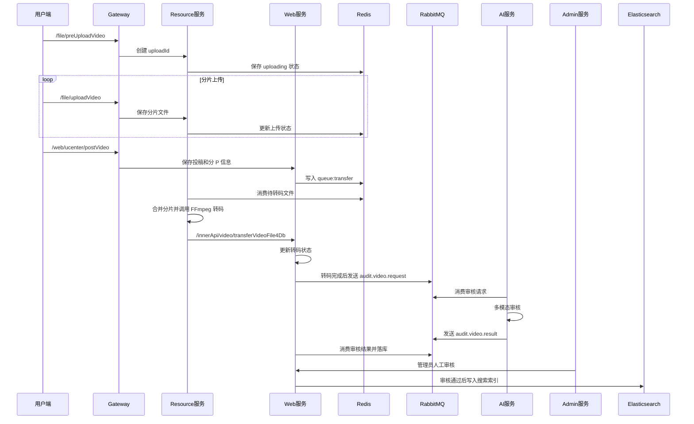

图 4-3 视频投稿、转码与审核流程图

资源服务消费转码队列的核心代码如代码 4-4 所示。该任务在服务启动后执行，不断从 Redis 队列中取出待转码文件，如果队列为空则休眠等待；如果存在任务，则交给 `TransferFileComponent` 进行转码处理。

```java
// 代码 4-4 Resource 服务消费转码队列核心代码
@PostConstruct
public void consumeTransferFileQueue() {
    executorService.execute(() -> {
        while (true) {
            VideoInfoFilePost videoInfoFile = redisComponent.getFileFromTransferQueue();
            if (videoInfoFile == null) {
                Thread.sleep(1500);
                continue;
            }
            transferFileComponent.transferVideoFile(videoInfoFile);
        }
    });
}
```

转码完成后的状态回写逻辑如代码 4-5 所示。`resource` 服务每完成一个分 P 文件转码后都会回写结果；`web` 服务判断是否存在失败文件，如果存在则将视频状态改为转码失败；如果所有分 P 都已经转码完成，则将视频状态改为待审核，并创建 AI 审核任务。

```java
// 代码 4-5 转码完成后进入待审核并触发 AI 审核
public void transferVideFile4Db(String videoId, String uploadId, String userId,
                                VideoInfoFilePost videoInfoFilePost) {
    videoInfoFilePostMapper.updateByUploadIdAndUserId(videoInfoFilePost, uploadId, userId);

    filePostQuery.setVideoId(videoId);
    filePostQuery.setTransferResult(VideoFileTransferResultEnum.FAIL.getStatus());
    Integer failCount = videoInfoFilePostMapper.selectCount(filePostQuery);
    if(failCount > 0) {
        videoUpdate.setStatus(VideoStatusEnum.STATUS1.getStatus());
        videoInfoPostMapper.updateByVideoId(videoUpdate, videoId);
        return;
    }

    filePostQuery.setTransferResult(VideoFileTransferResultEnum.TRANSFER.getStatus());
    Integer transferCount = videoInfoFilePostMapper.selectCount(filePostQuery);
    if(transferCount == 0) {
        videoUpdate.setStatus(VideoStatusEnum.STATUS2.getStatus());
        videoUpdate.setDuration(videoInfoFilePostMapper.sumDuration(videoId));
        videoInfoPostMapper.updateByVideoId(videoUpdate, videoId);
        aiAuditTaskService.createAuditTaskAndSend(videoId);
    }
}
```

AI 审核消息通道采用 RabbitMQ。系统定义 `streama.audit.exchange` 作为审核交换机，`streama.audit.request.queue` 作为请求队列，`streama.audit.result.queue` 作为结果队列，并为请求和结果分别配置死信队列。Java 后端在创建审核任务后发送 `audit.video.request` 消息，Python AI 服务消费后返回 `audit.video.result` 消息。RabbitMQ 通道设计如表 4-6 所示。

| 消息组件 | 名称 | 作用 |
| --- | --- | --- |
| Exchange | `streama.audit.exchange` | AI 审核请求和结果共用交换机 |
| 请求队列 | `streama.audit.request.queue` | AI 服务消费该队列中的审核请求 |
| 请求路由键 | `audit.video.request` | Java 后端发送审核请求时使用 |
| 结果队列 | `streama.audit.result.queue` | Java 后端消费 AI 审核结果 |
| 结果路由键 | `audit.video.result` | AI 服务发送审核结果时使用 |
| 请求死信队列 | `streama.audit.request.dlq` | 保存请求处理失败的消息 |
| 结果死信队列 | `streama.audit.result.dlq` | 保存结果处理失败的消息 |

AI 审核任务创建和消息发送的核心逻辑如代码 4-6 所示。系统为每次审核生成 `requestId` 和审核版本号，写入审核主表和审核明细表，再发送 RabbitMQ 消息。如果消息发送成功，任务状态更新为处理中；如果发送失败，则任务状态更新为失败，并记录错误信息。

```java
// 代码 4-6 AI 审核任务创建和消息发送核心代码
public void createAuditTaskAndSend(String videoId) {
    Integer auditVersion = maxVersion == null ? 1 : maxVersion + 1;
    aiAuditTask.setRequestId(UUID.randomUUID().toString().replace("-", ""));
    aiAuditTask.setVideoId(videoId);
    aiAuditTask.setAuditVersion(auditVersion);
    aiAuditTask.setTaskStatus(AiAuditTaskStatusEnum.PENDING.getStatus());
    aiAuditTaskMapper.insert(aiAuditTask);

    aiAuditTaskItemMapper.insertBatch(aiAuditTaskItems);
    AuditRequestMessage requestMessage = buildRequestMessage(aiAuditTask, videoInfoPost, aiAuditTaskItems);
    try {
        auditMqProducer.sendAuditRequest(requestMessage);
        taskUpdate.setTaskStatus(AiAuditTaskStatusEnum.PROCESSING.getStatus());
        aiAuditTaskMapper.updateByTaskId(taskUpdate, aiAuditTask.getTaskId());
    } catch (Exception e) {
        taskUpdate.setTaskStatus(AiAuditTaskStatusEnum.FAIL.getStatus());
        taskUpdate.setLastError(e.getMessage());
        aiAuditTaskMapper.updateByTaskId(taskUpdate, aiAuditTask.getTaskId());
    }
}
```

管理员审核是视频正式发布前的最后一步。管理员在后台查看视频和 AI 审核结果后，调用审核接口进行通过或驳回。如果审核驳回，系统只更新投稿状态；如果审核通过，系统将 `video_info_post` 复制到 `video_info`，将 `video_info_file_post` 复制到 `video_info_file`，清理待删除文件，并将正式视频写入 Elasticsearch 索引。这样可以保证只有人工确认通过的视频才会进入前台可播放、可搜索的视频列表。

播放与互动流程相对独立。用户播放视频时，前端通过 `/file/videoResource/{fileId}` 和 `/file/videoResource/{fileId}/{ts}` 获取 HLS 索引和切片资源；资源服务输出文件流后将播放事件写入 Redis 播放队列，后续由业务服务异步更新播放量。评论、弹幕、点赞、收藏和投币等行为由 `interact` 服务处理，需要更新视频计数或用户硬币时再通过 Feign 调用 `web` 服务。该设计避免了互动高频写入直接挤压视频主业务接口，提高了系统模块边界的清晰度。

# 第五章 系统详细设计与实现

本章在前文总体架构设计的基础上，对在线视频分享平台的核心功能模块进行详细说明。系统采用前后端分离与微服务相结合的实现方式，前端包括普通用户端和后台管理端，后端由网关服务、主站业务服务、资源文件服务、互动服务、后台管理服务以及公共基础模块组成，AI 审核服务则以独立 Python 微服务形式运行。各模块之间通过 HTTP 接口、OpenFeign、Redis 队列和 RabbitMQ 消息队列完成协作，共同支撑视频从上传、转码、审核、发布到播放互动的完整业务闭环。

## 5.1 用户端功能模块设计与实现

用户端是普通用户访问平台的主要入口，主要包括首页浏览、视频播放、用户登录注册、创作中心、个人稿件管理和互动管理等功能。前端用户端项目位于 `streama-frontend/streama-web`，核心页面集中在 `src/views` 目录下，主要包括 `HomeView.vue`、`VideoPlayView.vue`、`CreatorCenterView.vue` 和 `UserCenterView.vue` 等文件。用户端页面通过 Vue3 组件化方式组织界面，通过 Axios 封装接口请求，并通过路由完成首页、播放页、创作中心和个人中心之间的跳转。

用户端功能结构如图 5-1 所示。

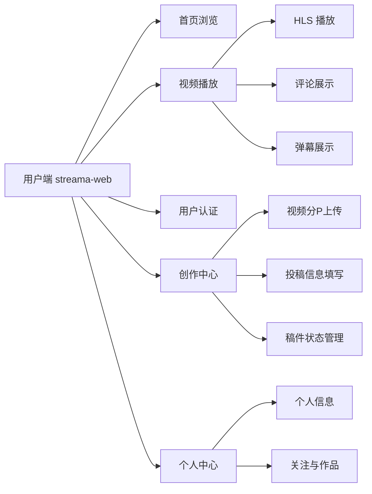

图 5-1 用户端功能结构图

首页模块主要用于展示平台中的视频内容。用户进入平台后，可以浏览视频列表，并根据分类、关键词或排序条件筛选视频。首页接口由后端 `streama-cloud-web` 服务提供，前端通过接口获取视频封面、标题、作者、播放量、弹幕数、发布时间等信息，并以卡片形式展示。视频卡片点击后进入视频播放页，播放页根据视频编号加载视频详情、分 P 信息、评论列表和弹幕数据。

视频播放模块是用户端的核心功能之一。由于系统资源服务会将原始视频转码为 HLS 格式，因此前端播放页不直接播放原始视频文件，而是请求资源服务提供的 `.m3u8` 索引文件，并由播放器按需加载 `.ts` 视频切片。该设计可以降低大文件直接加载带来的压力，提高视频播放的兼容性和稳定性。播放页除了视频本身外，还需要展示标题、作者信息、简介、分类、标签、播放量、点赞数、收藏数、投币数、评论数等信息，并提供点赞、收藏、投币、关注、发表评论和发送弹幕等交互入口。

创作中心主要面向内容创作者，页面文件为 `CreatorCenterView.vue`。该页面包含“投稿工作台”“稿件管理”“互动管理”等区域。投稿工作台用于上传视频文件、上传封面、填写标题、标签、简介、分类、投稿类型和互动设置；稿件管理用于查看当前用户已经提交的视频及其审核状态；互动管理用于管理自己视频下的评论和弹幕。为了提高大文件上传的稳定性，系统采用预上传和分片上传方式，前端先调用资源服务获取上传任务标识，再按照分片上传视频文件，上传完成后再提交投稿信息。

用户投稿流程如图 5-2 所示。

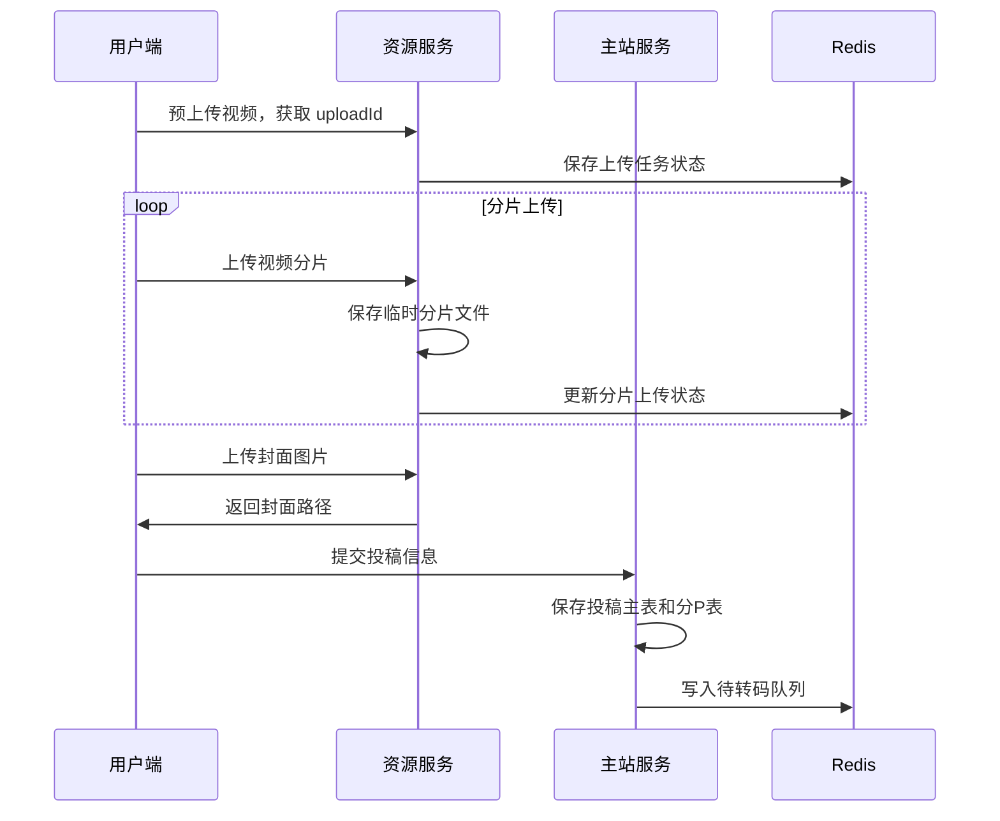

图 5-2 用户投稿与分片上传流程图

用户端主要功能实现说明如表 5-1 所示。

| 功能模块 | 前端实现位置            | 后端服务                                                     | 主要实现内容                               |
| -------- | ----------------------- | ------------------------------------------------------------ | ------------------------------------------ |
| 首页浏览 | `HomeView.vue`          | `streama-cloud-web`                                          | 视频列表加载、分类筛选、视频卡片展示       |
| 视频播放 | `VideoPlayView.vue`     | `streama-cloud-web`、`streama-cloud-resource`、`streama-cloud-interact` | 视频详情、HLS 播放、弹幕加载、评论互动     |
| 创作中心 | `CreatorCenterView.vue` | `streama-cloud-web`、`streama-cloud-resource`                | 分片上传、封面上传、投稿提交、稿件状态查看 |
| 用户中心 | `UserCenterView.vue`    | `streama-cloud-web`                                          | 用户资料、作品列表、关注信息展示           |
| 互动管理 | `CreatorCenterView.vue` | `streama-cloud-interact`                                     | 评论管理、弹幕管理、删除评论或弹幕         |

前端在进行接口请求时，通过统一请求工具完成基础地址配置、Token 携带和响应处理。普通用户登录成功后，后端会生成用户登录态并保存到 Redis，前端后续请求在请求头或参数中携带用户凭证，后端根据 Token 判断当前用户身份。该方式能够避免每个页面重复处理登录逻辑，也便于统一处理登录过期、接口异常和响应提示。

代码 5-1 给出了前端接口调用的通用写法示例。

```javascript
// 代码 5-1 前端接口调用示例
import request from '@/utils/request'

export function loadVideoList(params) {
  return request({
    url: '/web/video/loadVideoList',
    method: 'get',
    params
  })
}

export function submitVideo(data) {
  return request({
    url: '/web/ucenter/postVideo',
    method: 'post',
    data
  })
}
```

通过上述设计，用户端能够完成从普通浏览到视频投稿的主要功能。未登录用户可以浏览和搜索公开视频，登录用户可以进一步完成评论、弹幕、点赞、收藏、投币和投稿等操作，创作者可以通过创作中心查看稿件处理状态，从而形成普通用户和内容创作者的双重使用场景。

## 5.2 视频上传、转码与播放模块设计与实现

视频上传、转码与播放模块是在线视频分享平台区别于普通内容管理系统的关键模块。视频文件通常体积较大，如果直接上传完整文件，一旦网络中断就需要重新上传整个视频，用户体验较差。因此系统采用分片上传方式，将视频文件切分为多个分片分别上传，并在 Redis 中记录上传任务状态。资源服务负责保存临时分片，在投稿提交后将待处理文件加入转码队列，由后台线程异步执行合并、转码和切片操作。

资源文件服务由 `streama-cloud-resource` 实现，主要负责图片上传、视频预上传、分片上传、视频转码、HLS 文件输出以及播放资源读取。视频转码使用 FFmpeg 完成，转码后的文件会生成 `.m3u8` 索引文件和若干 `.ts` 切片文件。用户播放时，前端播放器首先请求 `.m3u8` 文件，再根据索引逐段加载 `.ts` 文件。该方式能够降低浏览器一次性加载大视频文件的压力，并且适合网页端流媒体播放。

视频处理流程如图 5-3 所示。

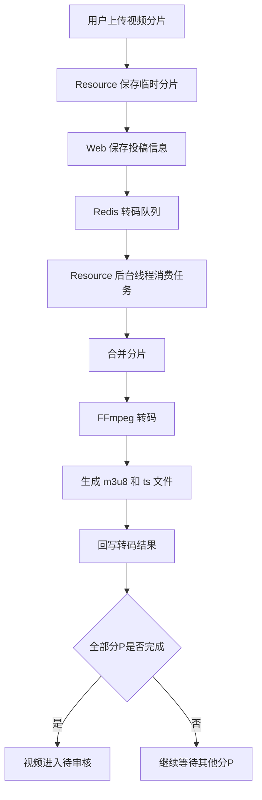

图 5-3 视频上传与转码处理流程图

资源服务中后台转码任务采用持续消费 Redis 队列的方式实现。服务启动后，后台线程不断从待转码队列中取出视频分 P 文件信息，如果队列为空则短暂休眠；如果存在任务，则调用转码组件执行文件合并和 FFmpeg 转码。该设计将耗时的视频处理过程从用户投稿请求中剥离出来，避免用户提交投稿时长时间等待。

代码 5-2 给出了资源服务消费转码队列的核心逻辑。

```java
// 代码 5-2 Resource 服务消费转码队列核心逻辑
@PostConstruct
public void consumeTransferFileQueue() {
    executorService.execute(() -> {
        while (true) {
            VideoInfoFilePost videoInfoFile = redisComponent.getFileFromTransferQueue();
            if (videoInfoFile == null) {
                Thread.sleep(1500);
                continue;
            }
            transferFileComponent.transferVideoFile(videoInfoFile);
        }
    });
}
```

转码完成后，资源服务并不直接修改投稿主业务数据，而是通过内部接口回调主站服务。主站服务根据所有分 P 文件的转码状态判断视频整体状态：如果存在转码失败的分 P，则将投稿状态更新为转码失败；如果所有分 P 均转码完成，则将视频状态更新为待审核，并触发后续 AI 审核任务。这样可以保证资源服务只关注文件处理，视频状态流转仍由主业务服务统一维护。

代码 5-3 给出了转码结果回写和触发 AI 审核的核心逻辑。

```java
// 代码 5-3 转码完成后进入待审核并触发 AI 审核
public void transferVideFile4Db(String videoId, String uploadId, String userId,
                                VideoInfoFilePost videoInfoFilePost) {
    videoInfoFilePostMapper.updateByUploadIdAndUserId(videoInfoFilePost, uploadId, userId);

    filePostQuery.setVideoId(videoId);
    filePostQuery.setTransferResult(VideoFileTransferResultEnum.FAIL.getStatus());
    Integer failCount = videoInfoFilePostMapper.selectCount(filePostQuery);
    if (failCount > 0) {
        videoUpdate.setStatus(VideoStatusEnum.STATUS1.getStatus());
        videoInfoPostMapper.updateByVideoId(videoUpdate, videoId);
        return;
    }

    filePostQuery.setTransferResult(VideoFileTransferResultEnum.TRANSFER.getStatus());
    Integer transferCount = videoInfoFilePostMapper.selectCount(filePostQuery);
    if (transferCount == 0) {
        videoUpdate.setStatus(VideoStatusEnum.STATUS2.getStatus());
        videoUpdate.setDuration(videoInfoFilePostMapper.sumDuration(videoId));
        videoInfoPostMapper.updateByVideoId(videoUpdate, videoId);
        aiAuditTaskService.createAuditTaskAndSend(videoId);
    }
}
```

视频播放资源由资源服务统一输出。前端播放页请求某一分 P 的视频资源时，资源服务读取转码后的 `.m3u8` 文件和 `.ts` 切片文件并返回给浏览器。播放行为还会写入 Redis 播放计数队列，由主站服务异步累加播放量，避免播放接口频繁直接更新数据库。该设计能够减少视频播放高频访问对数据库造成的压力。

视频上传、转码与播放模块的实现要点如表 5-2 所示。

| 实现环节 | 设计方式                    | 作用                           |
| -------- | --------------------------- | ------------------------------ |
| 预上传   | 生成 uploadId 并写入 Redis  | 标识一次上传任务，保存上传状态 |
| 分片上传 | 视频文件分片保存到临时目录  | 降低大文件上传失败成本         |
| 投稿提交 | Web 服务保存投稿表和分 P 表 | 建立视频业务数据和文件数据关系 |
| 转码队列 | Redis List 保存待转码任务   | 解耦投稿请求和转码处理         |
| 视频转码 | FFmpeg 生成 HLS 文件        | 提高网页播放兼容性             |
| 状态回写 | Resource 调用 Web 内部接口  | 统一维护视频状态流转           |
| 播放资源 | Resource 输出 m3u8/ts 文件  | 支持前端在线播放               |
| 播放统计 | Redis 队列异步累加播放量    | 降低数据库写入压力             |

## 5.3 互动、搜索与后台管理模块设计与实现

互动模块主要包括评论、弹幕、点赞、收藏、投币和关注等功能。由于这些行为属于用户高频操作，如果全部放在主站服务中，会导致视频主业务与互动行为耦合过高。因此系统将互动行为拆分到 `streama-cloud-interact` 服务中独立处理。互动服务负责保存评论、弹幕和用户行为记录，在需要更新视频计数或用户硬币数量时，再通过 Feign 调用主站服务完成相关数据更新。

互动模块流程如图 5-4 所示。

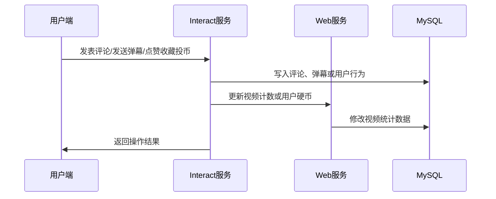

图 5-4 用户互动处理流程图

评论功能需要支持评论列表查询、发表评论、删除评论和评论点赞等操作。弹幕功能需要在播放页按照视频播放时间展示，弹幕数据需要包含视频编号、文件编号、出现时间、弹幕文本、颜色和弹幕模式等字段。点赞、收藏和投币功能则通过用户行为表记录用户与视频之间的行为关系，避免同一用户重复点赞或重复收藏。

搜索模块由主站服务结合 Elasticsearch 实现。视频审核通过后，系统将视频标题、标签、简介、分类、播放量、弹幕数、收藏数等信息写入 `streama_video` 索引。用户搜索时，系统优先查询 Elasticsearch，以支持关键词检索、排序和热词统计。与 MySQL 模糊查询相比，Elasticsearch 更适合视频标题、简介和标签的全文检索，也便于后续扩展推荐和相关视频功能。

搜索模块设计如表 5-3 所示。

| 搜索场景   | 数据来源              | 实现方式                   | 说明                   |
| ---------- | --------------------- | -------------------------- | ---------------------- |
| 首页推荐   | MySQL / Elasticsearch | 按发布时间、播放量等排序   | 展示公开视频列表       |
| 关键词搜索 | Elasticsearch         | 匹配标题、简介、标签       | 支持全文检索           |
| 分类筛选   | MySQL / Elasticsearch | 根据分类 ID 查询           | 支持一级、二级分类筛选 |
| 搜索热词   | Redis ZSet            | 记录关键词搜索次数         | 用于展示热门搜索词     |
| 相关视频   | Elasticsearch         | 根据分类、标签或关键词查询 | 用于播放页相关推荐     |

后台管理模块由 `streama-cloud-admin` 和 `streama-frontend/streama-admin` 共同实现。后台前端主要页面包括登录页、后台首页、仪表盘、分类管理、视频审核列表和视频审核详情页。管理员登录成功后，可以维护视频分类，也可以查看待审核视频列表并进行人工审核。视频审核详情页用于展示投稿视频、投稿用户、视频分 P、AI 审核建议、风险等级、审核摘要和人工审核操作入口。

后台管理模块功能如表 5-4 所示。

| 功能模块     | 前端页面                   | 后端服务                                                     | 主要功能                          |
| ------------ | -------------------------- | ------------------------------------------------------------ | --------------------------------- |
| 管理员登录   | `LoginView.vue`            | `streama-cloud-admin`                                        | 后台登录、验证码校验、Token 维护  |
| 后台布局     | `AdminLayout.vue`          | `streama-cloud-admin`                                        | 菜单导航、页面容器、登录态校验    |
| 分类管理     | `CategoryManageView.vue`   | `streama-cloud-admin`                                        | 分类新增、编辑、删除、排序        |
| 视频审核列表 | `VideoAuditView.vue`       | `streama-cloud-admin`、`streama-cloud-web`                   | 查询投稿视频、筛选审核状态        |
| 视频审核详情 | `VideoAuditDetailView.vue` | `streama-cloud-admin`、`streama-cloud-web`、`streama-cloud-resource` | 查看视频、AI 结果、执行通过或驳回 |
| 审核播放器   | `AuditVideoPlayer.vue`     | `streama-cloud-resource`                                     | 管理端预览待审核视频              |

管理员审核流程如图 5-5 所示。

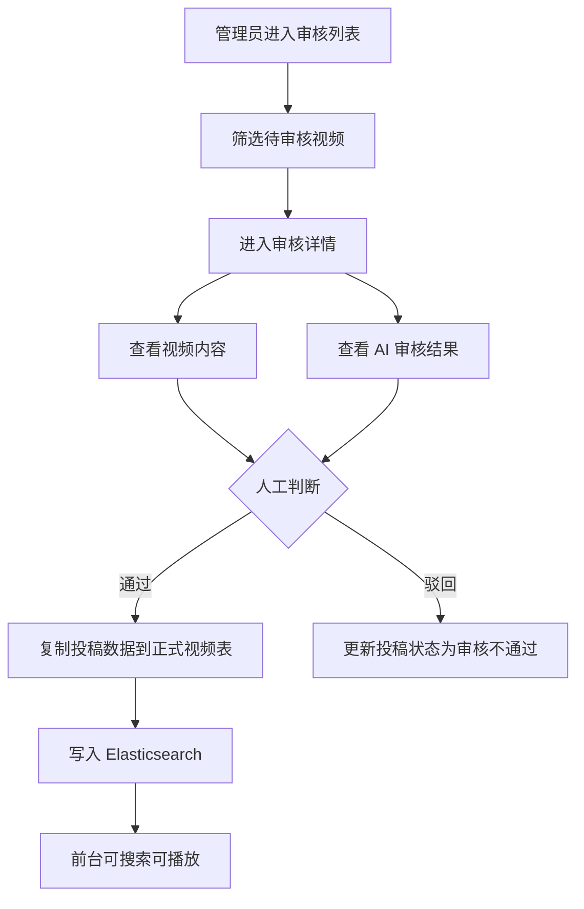

图 5-5 后台人工审核流程图

后台审核并不是简单地把视频状态改为通过，而是需要完成投稿数据到正式数据的迁移。系统在投稿阶段将视频保存在 `video_info_post` 和 `video_info_file_post` 中，只有管理员审核通过后，才会将数据写入 `video_info` 和 `video_info_file`，并同步写入 Elasticsearch 搜索索引。该设计可以有效避免未审核内容进入前台展示，也使投稿态数据和正式发布数据之间有清晰边界。

## 5.4 AI 审核与人机协同模块设计与实现

AI 审核模块是系统内容安全治理的重要组成部分。传统人工审核需要管理员逐个观看视频，效率较低，且在视频数量较多时容易出现漏审。因此系统设计了独立的 AI 审核服务，对上传后的视频进行自动化初审，并将审核建议返回给后台管理端，管理员再结合 AI 结果进行最终判断。该流程形成“AI 初审 + 人工终审”的人机协同审核机制。

AI 审核服务位于 `ai-service` 目录，服务名为 `streama-cloud-ai`，默认端口为 7075。该服务通过 RabbitMQ 消费审核请求，并将审核结果发送回后端。AI 审核请求队列为 `streama.audit.request.queue`，结果路由键为 `audit.video.result`。服务内部主要由 `app.py`、`config.py`、`models.py`、`moderation.py`、`mq.py`、`nacos.py`、`service.py` 和 `video_moderation.py` 等文件组成，分别负责服务启动、配置读取、数据模型、审核流程、消息通信、Nacos 注册和视频分析等工作。

AI 审核整体流程如图 5-6 所示。

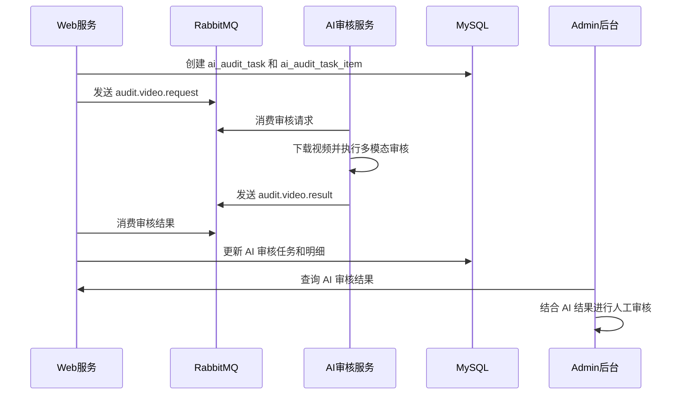

图 5-6 AI 审核与人工审核协同流程图

AI 审核服务从视频中提取多种信息进行综合判断。首先，服务根据后端传入的视频文件路径或资源地址获取待审核视频；然后使用 FFmpeg 提取音频，并使用 VAD 技术检测语音片段；接着使用 Whisper 将语音内容转写为文本；同时使用 YAMNet 对声音事件进行识别，判断是否存在尖叫、爆炸、警报等异常声音；之后从视频中抽取关键帧，将画面、文本和声音信息交给多模态模型进行综合判断。最终，服务生成视频级审核建议、风险等级、风险标签、命中片段和原因说明，并通过 RabbitMQ 返回给 Java 后端。

AI 审核结果结构如表 5-5 所示。

| 结果层级 | 字段              | 含义                                | 展示位置           |
| -------- | ----------------- | ----------------------------------- | ------------------ |
| 视频级   | `aiDecision`      | AI 审核建议，如通过、驳回、人工复核 | 审核列表、审核详情 |
| 视频级   | `aiRiskLevel`     | 视频整体风险等级                    | 审核列表、审核详情 |
| 视频级   | `aiSummary`       | AI 对视频风险的摘要说明             | 审核详情           |
| 分 P 级  | `itemDecision`    | 某个分 P 的审核建议                 | 审核详情分 P 区域  |
| 分 P 级  | `riskScore`       | 某个分 P 的风险分值                 | 审核详情分 P 区域  |
| 分 P 级  | `riskTagsJson`    | 风险标签列表                        | 审核详情风险标签   |
| 命中段级 | `hitSegmentsJson` | 命中时间段、风险类型和原因          | 审核详情风险片段   |

Java 后端在转码完成后创建 AI 审核任务，并发送 RabbitMQ 消息。系统为每次审核生成唯一请求编号和审核版本号，先将任务写入数据库，再发送消息。如果消息发送成功，任务状态更新为处理中；如果发送失败，则记录失败状态和错误信息，便于管理员或系统后续排查。

代码 5-4 给出了 AI 审核任务创建与消息发送的核心逻辑。

```java
// 代码 5-4 AI 审核任务创建与消息发送核心逻辑
public void createAuditTaskAndSend(String videoId) {
    Integer auditVersion = maxVersion == null ? 1 : maxVersion + 1;
    aiAuditTask.setRequestId(UUID.randomUUID().toString().replace("-", ""));
    aiAuditTask.setVideoId(videoId);
    aiAuditTask.setAuditVersion(auditVersion);
    aiAuditTask.setTaskStatus(AiAuditTaskStatusEnum.PENDING.getStatus());
    aiAuditTaskMapper.insert(aiAuditTask);
    aiAuditTaskItemMapper.insertBatch(aiAuditTaskItems);

    AuditRequestMessage requestMessage = buildRequestMessage(
        aiAuditTask, videoInfoPost, aiAuditTaskItems
    );

    try {
        auditMqProducer.sendAuditRequest(requestMessage);
        taskUpdate.setTaskStatus(AiAuditTaskStatusEnum.PROCESSING.getStatus());
        aiAuditTaskMapper.updateByTaskId(taskUpdate, aiAuditTask.getTaskId());
    } catch (Exception e) {
        taskUpdate.setTaskStatus(AiAuditTaskStatusEnum.FAIL.getStatus());
        taskUpdate.setLastError(e.getMessage());
        aiAuditTaskMapper.updateByTaskId(taskUpdate, aiAuditTask.getTaskId());
    }
}
```

人机协同审核的关键在于 AI 不直接决定视频是否发布，而是为管理员提供辅助判断。即使 AI 建议通过，管理员仍需要在后台确认后视频才能进入正式发布表；如果 AI 判断存在风险，管理员可以查看风险摘要、命中标签和命中片段后决定驳回或人工复核。这样既提高了审核效率，也避免模型误判直接影响视频发布。

AI 审核与人工审核的职责划分如表 5-6 所示。

| 审核主体    | 主要职责                                 | 优点                                   | 局限                             |
| ----------- | ---------------------------------------- | -------------------------------------- | -------------------------------- |
| AI 审核服务 | 自动分析视频画面、语音文本和声音事件     | 速度快、可批量处理、能提供初步风险提示 | 可能误判，复杂语义理解仍有限     |
| 管理员      | 查看视频内容和 AI 结果，做最终通过或驳回 | 判断更灵活，能结合平台规则处理         | 人工成本较高，审核效率受人员影响 |
| 协同机制    | AI 初审后人工终审                        | 兼顾效率和准确性                       | 需要良好的结果展示和异常处理机制 |

综上，本系统通过 RabbitMQ 将 Java 业务系统与 Python AI 服务解耦，通过 AI 审核表保存结构化审核结果，通过后台管理端展示风险信息并执行人工审核，形成了较完整的视频内容治理流程。

# 第六章 系统测试与结果分析

系统测试的目的是验证在线视频分享平台的核心功能是否能够按照需求正常运行，并检查微服务调用、视频上传转码、前端交互、后台审核和 AI 审核等关键流程是否具备完整性。本章主要从测试环境、测试方案、核心功能测试、AI 审核与异常场景测试以及测试结果分析几个方面进行说明。由于本系统涉及多个服务和中间件，测试不仅需要关注单个接口是否可用，还需要关注跨服务业务链路是否能够正确流转。

## 6.1 测试环境与测试方案

系统测试环境主要包括前端运行环境、Java 后端运行环境、Python AI 服务环境以及数据库和中间件环境。测试时需要先启动 MySQL、Redis、Elasticsearch、RabbitMQ、Nacos 和 Seata 等基础组件，再启动后端网关、主站服务、后台管理服务、资源服务、互动服务和 AI 审核服务，最后启动用户端和管理端前端项目。

测试环境配置如表 6-1 所示。

| 环境类别    | 配置项            | 说明                                       |
| ----------- | ----------------- | ------------------------------------------ |
| 操作系统    | Windows / Linux   | 本地开发与演示环境均可运行                 |
| 后端环境    | JDK 17、Maven     | 用于运行 Spring Boot / Spring Cloud 微服务 |
| 前端环境    | Node.js、npm      | 用于运行 Vue3 + Vite 前端项目              |
| AI 服务环境 | Python、CUDA 环境 | 用于运行 AI 审核服务和多模态模型           |
| 数据库      | MySQL 8           | 保存用户、视频、投稿、互动和审核数据       |
| 缓存        | Redis             | 保存登录态、验证码、上传状态和异步队列     |
| 搜索引擎    | Elasticsearch     | 支持视频全文检索                           |
| 消息队列    | RabbitMQ          | 传递 AI 审核请求和审核结果                 |
| 注册中心    | Nacos             | 管理微服务注册发现和配置                   |
| 视频工具    | FFmpeg            | 完成视频转码、切片和音频提取               |

本系统测试采用功能测试和流程测试相结合的方式。功能测试用于验证单个模块是否满足需求，例如登录、视频列表、评论、弹幕、分类管理等；流程测试用于验证完整业务链路是否顺畅，例如视频从上传到转码、AI 审核、人工审核再到前台播放的完整过程；异常测试用于验证系统在上传失败、转码失败、AI 审核失败、未登录访问和权限不足等情况下是否能够给出合理处理。

系统测试方案如表 6-2 所示。

| 测试类型       | 测试内容                                       | 测试目标                   |
| -------------- | ---------------------------------------------- | -------------------------- |
| 用户端功能测试 | 首页、搜索、播放、评论、弹幕、点赞、收藏、投币 | 验证普通用户功能可正常使用 |
| 创作中心测试   | 封面上传、视频分片上传、投稿提交、稿件状态查看 | 验证创作者投稿流程完整     |
| 后台管理测试   | 管理员登录、分类管理、视频审核                 | 验证后台管理功能可用       |
| 视频处理测试   | 分片保存、转码、HLS 播放、播放统计             | 验证资源服务处理能力       |
| AI 审核测试    | 审核任务创建、消息发送、结果回写、后台展示     | 验证 AI 审核闭环           |
| 异常场景测试   | 未登录操作、转码失败、AI 失败、重复审核        | 验证系统异常处理能力       |

在测试过程中，应准备至少三类视频样本：一类为普通无风险视频，用于验证正常通过流程；一类为包含明显风险声音或敏感语义的视频，用于验证 AI 审核风险识别；一类为格式异常或损坏视频，用于验证转码失败和异常处理流程。为了保证论文测试结果更加可信，建议在最终论文中加入用户端首页、创作中心、视频播放页、后台审核详情页和 AI 审核结果页的实际运行截图。

> 图 6-1 建议插入：用户端首页运行截图
> 图 6-2 建议插入：创作中心投稿页面截图
> 图 6-3 建议插入：视频播放页与弹幕评论截图
> 图 6-4 建议插入：后台视频审核详情页截图
> 图 6-5 建议插入：AI 审核结果展示截图

## 6.2 核心功能测试

核心功能测试主要验证系统的基础业务功能是否可以正常完成，包括用户认证、视频浏览、视频播放、投稿上传、评论弹幕、点赞收藏投币、分类管理和人工审核等。测试时应以实际用户操作流程为主，从前端页面发起请求，观察页面响应、后端接口返回和数据库数据变化是否符合预期。

用户端核心功能测试用例如表 6-3 所示。

| 编号  | 测试功能     | 测试步骤                         | 预期结果                                       | 测试结论    |
| ----- | ------------ | -------------------------------- | ---------------------------------------------- | ----------- |
| TC-01 | 用户登录     | 输入正确账号、密码和验证码后登录 | 登录成功，页面显示用户信息，后续请求携带登录态 | 通过/待实测 |
| TC-02 | 首页视频列表 | 打开首页并加载视频列表           | 页面展示视频封面、标题、作者和统计数据         | 通过/待实测 |
| TC-03 | 视频搜索     | 输入关键词进行搜索               | 返回与关键词相关的视频列表，并支持排序         | 通过/待实测 |
| TC-04 | 视频播放     | 进入播放页并播放视频             | 视频可正常加载 HLS 资源并播放                  | 通过/待实测 |
| TC-05 | 发表评论     | 登录后在播放页发表评论           | 评论成功显示在评论列表中                       | 通过/待实测 |
| TC-06 | 发送弹幕     | 播放视频时发送弹幕               | 弹幕保存成功并在对应时间点显示                 | 通过/待实测 |
| TC-07 | 点赞收藏投币 | 对视频执行互动操作               | 操作成功，视频计数和用户行为记录更新           | 通过/待实测 |
| TC-08 | 关注作者     | 在播放页或作者页点击关注         | 关注关系建立，按钮状态变化                     | 通过/待实测 |

创作中心与视频处理测试用例如表 6-4 所示。

| 编号  | 测试功能     | 测试步骤                         | 预期结果                                        | 测试结论    |
| ----- | ------------ | -------------------------------- | ----------------------------------------------- | ----------- |
| TC-09 | 封面上传     | 在创作中心上传图片封面           | 上传成功，页面显示封面预览，返回封面路径        | 通过/待实测 |
| TC-10 | 视频预上传   | 选择视频文件并创建上传任务       | 系统返回 uploadId，Redis 保存上传状态           | 通过/待实测 |
| TC-11 | 视频分片上传 | 将视频分片上传至资源服务         | 所有分片保存成功，上传进度正确显示              | 通过/待实测 |
| TC-12 | 投稿提交     | 填写标题、分类、标签和简介后提交 | 投稿数据写入投稿表，状态为转码中                | 通过/待实测 |
| TC-13 | 视频转码     | 等待资源服务消费转码队列         | 生成 `.m3u8` 和 `.ts` 文件，分 P 状态为转码成功 | 通过/待实测 |
| TC-14 | 状态回写     | 所有分 P 转码完成后查看稿件状态  | 视频状态变更为待审核，并触发 AI 审核任务        | 通过/待实测 |
| TC-15 | 播放统计     | 播放审核通过的视频               | 播放事件写入队列，播放量异步增加                | 通过/待实测 |

后台管理测试用例如表 6-5 所示。

| 编号  | 测试功能     | 测试步骤                         | 预期结果                                   | 测试结论    |
| ----- | ------------ | -------------------------------- | ------------------------------------------ | ----------- |
| TC-16 | 管理员登录   | 输入管理员账号、密码和验证码     | 登录成功并进入后台首页                     | 通过/待实测 |
| TC-17 | 分类新增     | 在分类管理页新增一级或二级分类   | 分类保存成功，前台投稿可选择该分类         | 通过/待实测 |
| TC-18 | 分类编辑     | 修改分类名称、图标或排序         | 修改成功，页面刷新后显示新数据             | 通过/待实测 |
| TC-19 | 视频审核列表 | 打开视频审核列表并筛选待审核状态 | 正确展示待审核视频和投稿用户信息           | 通过/待实测 |
| TC-20 | 审核详情     | 进入视频审核详情页               | 能查看视频、分 P 信息和 AI 审核摘要        | 通过/待实测 |
| TC-21 | 审核通过     | 管理员点击通过                   | 投稿数据复制到正式视频表，并写入搜索索引   | 通过/待实测 |
| TC-22 | 审核驳回     | 管理员点击驳回                   | 投稿状态变为审核不通过，视频不进入前台列表 | 通过/待实测 |

通过上述测试，可以验证系统普通用户端、创作中心和后台管理端的主要功能是否满足需求。对于最终论文，建议将“测试结论”列中的“待实测”替换为实际运行后的“通过”或“未通过”，并在未通过时说明问题原因和解决方式。

## 6.3 AI 审核与异常场景测试

AI 审核流程涉及 Java 后端、RabbitMQ、Python AI 服务、MySQL 和后台管理端多个部分，是系统测试中的重点。测试时需要先保证 RabbitMQ 队列和 AI 服务正常启动，然后提交一个转码完成的视频，观察系统是否创建审核任务、是否发送审核请求、AI 服务是否消费消息、审核结果是否返回并落库，以及后台页面是否能够查询到审核结果。

AI 审核流程测试用例如表 6-6 所示。

| 编号  | 测试功能     | 测试步骤                         | 预期结果                                          | 测试结论    |
| ----- | ------------ | -------------------------------- | ------------------------------------------------- | ----------- |
| TC-23 | AI 任务创建  | 视频转码完成后查询审核任务表     | 生成 `ai_audit_task` 和 `ai_audit_task_item` 记录 | 通过/待实测 |
| TC-24 | 审核请求发送 | 查看 RabbitMQ 请求队列           | 队列收到 `audit.video.request` 消息               | 通过/待实测 |
| TC-25 | AI 服务消费  | 启动 AI 服务并提交审核视频       | AI 服务消费消息并开始处理                         | 通过/待实测 |
| TC-26 | 审核结果回传 | 等待 AI 服务完成审核             | 返回 `audit.video.result` 消息                    | 通过/待实测 |
| TC-27 | 审核结果落库 | 查询 AI 审核主表和明细表         | 任务状态更新，风险等级和摘要写入数据库            | 通过/待实测 |
| TC-28 | 后台结果展示 | 管理员打开审核详情页             | 页面展示 AI 建议、风险等级、摘要和分 P 明细       | 通过/待实测 |
| TC-29 | 人工复核     | 管理员结合 AI 结果执行通过或驳回 | 人工审核结果生效，视频状态正确变化                | 通过/待实测 |

异常场景测试主要用于验证系统在非正常情况下能否保持稳定。在线视频平台的异常情况较多，例如用户未登录却尝试评论，视频上传中断，视频格式无法转码，AI 服务未启动，RabbitMQ 消息发送失败，管理员访问不存在的视频等。系统应对这些情况进行合理处理，避免出现无响应、数据状态混乱或未审核内容误发布等问题。

异常场景测试用例如表 6-7 所示。

| 编号  | 异常场景          | 测试步骤                     | 预期结果                                          | 测试结论    |
| ----- | ----------------- | ---------------------------- | ------------------------------------------------- | ----------- |
| EX-01 | 未登录评论        | 未登录用户尝试发表评论       | 系统提示登录，不写入评论数据                      | 通过/待实测 |
| EX-02 | 上传中断          | 上传视频分片过程中断网络     | 已上传分片状态保留，用户可重新上传                | 通过/待实测 |
| EX-03 | 转码失败          | 上传损坏或不支持格式的视频   | 分 P 状态为转码失败，视频状态为转码失败           | 通过/待实测 |
| EX-04 | AI 服务未启动     | 转码完成后关闭 AI 服务       | AI 任务停留在待处理或失败状态，不影响人工审核入口 | 通过/待实测 |
| EX-05 | RabbitMQ 发送失败 | 停止 RabbitMQ 后触发审核任务 | 任务记录失败原因，系统不崩溃                      | 通过/待实测 |
| EX-06 | 重复审核消息      | 手动重复投递同一审核请求     | 系统应避免重复覆盖或造成异常状态                  | 通过/待实测 |
| EX-07 | 非管理员访问后台  | 普通用户访问后台接口         | 网关或后台服务拒绝访问                            | 通过/待实测 |
| EX-08 | 外部访问内部接口  | 访问包含 `/innerApi` 的路径  | 网关拦截并返回异常                                | 通过/待实测 |

AI 审核异常处理流程如图 6-6 所示。

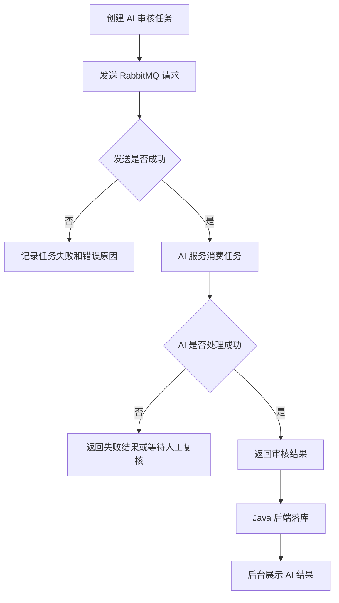

图 6-6 AI 审核异常处理流程图

异常测试说明本系统在设计上采用了状态记录、异步消息、失败原因保存和人工复核等方式提高流程可靠性。即使 AI 审核服务出现故障，视频也不会直接发布，而是可以由管理员进行人工复核，从而避免审核服务异常影响平台内容安全。

## 6.4 测试结果分析

从功能测试角度看，系统覆盖了在线视频分享平台的主要业务场景，包括用户登录、视频浏览、视频播放、视频投稿、评论弹幕、点赞收藏投币、后台分类管理、视频审核和 AI 审核等功能。用户端能够完成普通用户观看视频和参与互动的需求，创作中心能够完成视频上传和稿件管理需求，后台管理端能够完成分类维护和视频审核需求。

从流程测试角度看，系统实现了视频生命周期的闭环。用户提交投稿后，系统将投稿数据保存到投稿表，资源服务通过 Redis 队列异步执行视频转码，转码完成后主站服务更新视频状态并触发 AI 审核任务，AI 服务通过 RabbitMQ 返回审核结果，管理员在后台结合 AI 结果完成最终审核，审核通过后视频进入正式表并写入 Elasticsearch，最终可以在前台被搜索和播放。该流程说明系统各微服务之间能够按照设计进行协作。

从异常处理角度看，系统对未登录访问、后台权限控制、内部接口隔离、视频转码失败、AI 审核失败和消息发送异常等情况进行了相应设计。对于普通用户无权限操作，系统通过登录态进行限制；对于后台接口，系统通过管理员登录态和网关过滤保护；对于内部接口，系统通过 `/innerApi` 路径隔离避免外部直接访问；对于视频转码和 AI 审核失败，系统通过状态字段和错误信息记录，使管理员可以进一步处理。

系统测试结果汇总如表 6-8 所示。

| 测试类别   | 测试内容                     | 结果分析                               |
| ---------- | ---------------------------- | -------------------------------------- |
| 用户端功能 | 登录、浏览、搜索、播放、互动 | 能够覆盖普通用户主要使用场景           |
| 创作中心   | 分片上传、投稿提交、稿件管理 | 能够完成视频投稿和状态查看流程         |
| 资源处理   | 分片保存、转码、HLS 输出     | 支持视频从原始文件到网页播放资源的转换 |
| 后台管理   | 分类管理、视频审核、审核详情 | 支持管理员进行内容管理和人工审核       |
| AI 审核    | 审核任务、消息通信、结果展示 | 支持 AI 初审和人工终审的协同流程       |
| 异常场景   | 权限不足、转码失败、AI 失败  | 能够通过状态记录和人工处理避免流程中断 |

总体来看，本系统能够满足毕业设计任务中对在线视频分享平台的核心要求。系统不仅实现了前台视频浏览播放和用户互动，还实现了创作中心投稿、资源服务转码、后台审核和 AI 智能审核等功能，体现了微服务架构在复杂业务拆分中的应用价值。不过，由于系统仍属于毕业设计原型，在大规模并发访问、分布式文件存储、模型审核准确率评估和自动化测试覆盖率方面仍有进一步优化空间。

# 第七章 总结与展望

## 7.1 研究工作总结

本文围绕“基于微服务架构的在线视频分享平台设计与实现”展开研究与开发，完成了一个具有视频浏览、视频投稿、分片上传、转码播放、用户互动、后台管理和 AI 审核能力的在线视频分享平台原型。系统采用前后端分离架构，普通用户端和后台管理端均基于 Vue3 技术栈实现，后端采用 Spring Cloud Alibaba 微服务体系进行模块拆分，AI 审核服务则采用独立 Python 微服务实现。

在需求分析阶段，本文从普通用户、内容创作者、管理员和 AI 审核服务四类角色出发，分析了系统需要实现的功能需求和非功能需求。普通用户需要完成视频浏览、搜索、播放和互动；内容创作者需要完成视频投稿和稿件管理；管理员需要完成分类管理和视频审核；AI 审核服务需要对上传视频进行自动化风险分析。系统还需要满足可维护性、可扩展性、安全性和数据一致性等非功能需求。

在系统设计阶段，本文将后端划分为网关服务、主站业务服务、后台管理服务、资源文件服务、互动服务、公共模块和基础模块，并将 AI 审核能力拆分为独立服务。网关服务负责统一入口和请求路由，主站服务负责用户、视频、投稿、搜索和 AI 任务编排，资源服务负责图片上传、视频分片上传和转码播放，互动服务负责评论、弹幕和用户行为，后台服务负责管理端登录、分类管理和视频审核代理。各服务通过 Nacos、OpenFeign、Redis、RabbitMQ 和数据库协作完成业务流程。

在系统实现阶段，本文重点完成了视频生命周期相关功能。用户在创作中心上传视频和封面后，系统采用分片上传方式保存视频文件，并在投稿提交后将待转码任务写入 Redis 队列。资源服务后台线程消费转码任务，调用 FFmpeg 对视频进行合并、转码和 HLS 切片，转码完成后回写主站服务。主站服务在确认所有分 P 转码完成后，将视频状态更新为待审核，并创建 AI 审核任务。AI 服务消费 RabbitMQ 审核请求后，对视频进行音频提取、语音转写、声音事件检测、关键帧抽取和多模态分析，并将审核结果返回后端。管理员最终在后台结合 AI 结果执行人工通过或驳回。

在系统测试阶段，本文围绕用户端、创作中心、资源处理、后台管理、AI 审核和异常场景设计了测试用例。测试内容覆盖登录、视频列表、视频播放、评论弹幕、点赞收藏投币、封面上传、视频分片上传、视频转码、审核任务创建、AI 结果回写和后台人工审核等功能。测试结果表明，系统能够完成在线视频分享平台的主要业务流程，并能够通过异步任务和服务拆分提高系统结构清晰度。

综上所述，本文完成了一个功能较完整、架构较清晰的在线视频分享平台设计与实现。系统不仅能够展示在线视频平台常见的浏览、播放、投稿和互动功能，还结合微服务架构、视频转码、搜索引擎、消息队列和 AI 多模态审核技术，形成了从内容生产到内容治理的完整流程。

## 7.2 项目创新点与不足

本项目的创新点主要体现在以下几个方面。

第一，系统采用微服务架构对在线视频平台进行模块化拆分。与传统单体项目相比，本系统将主站业务、资源处理、互动行为、后台管理和 AI 审核拆分为不同服务，各服务职责更加清晰。资源服务专注于文件和视频处理，互动服务独立处理评论、弹幕和用户行为，AI 审核服务独立部署在 Python 环境中，降低了不同业务之间的耦合度，也便于后续单独扩展或维护。

第二，系统实现了视频分片上传、异步转码和 HLS 播放链路。视频文件通常体积较大，直接上传和播放容易出现失败或卡顿问题。本系统通过分片上传降低上传失败成本，通过 Redis 队列异步处理转码任务，通过 FFmpeg 生成 HLS 视频资源，使视频能够以更适合网页端的方式播放。该设计体现了在线视频平台的核心工程特点。

第三，系统引入 AI 审核服务实现内容安全辅助判断。AI 服务不只是简单地判断文本关键词，而是结合语音识别、声音事件检测、关键帧抽取和多模态模型进行综合分析，并将审核建议、风险等级和风险原因返回给后台。管理员可以根据 AI 结果进行人工复核，从而形成“AI 初审 + 人工终审”的协同审核流程。

第四，系统在数据设计上采用投稿表和正式表分离的方式。用户提交的视频先保存在投稿表中，只有转码完成并经管理员审核通过后才进入正式视频表和搜索索引。该设计能够有效避免未审核内容直接进入前台展示，也使视频审核状态流转更加清晰。

第五，系统综合使用 MySQL、Redis、Elasticsearch 和 RabbitMQ 等多种数据与通信组件。MySQL 保存核心业务数据，Redis 保存登录态、验证码、上传状态和轻量队列，Elasticsearch 支持视频全文检索，RabbitMQ 支持 AI 审核请求与结果回传。多组件协同体现了系统工程实践的综合性。

同时，本项目也存在一些不足。

第一，系统仍属于毕业设计原型，尚未进行大规模并发访问测试。在真实视频平台场景中，视频播放、评论弹幕和搜索接口都可能面临较高并发压力，需要进一步进行性能压测、限流、缓存优化和服务扩容设计。

第二，文件存储当前主要采用本地目录方式。该方式适合本地开发和演示，但在多实例部署或服务器迁移时存在共享和扩展问题。后续可以使用 MinIO、OSS 或其他对象存储服务保存封面、视频切片和审核截图。

第三，AI 审核模型的准确率和稳定性仍有提升空间。多模态模型对硬件环境要求较高，完整审核流程依赖 GPU 环境；对于复杂语义、隐喻表达或画面上下文，模型仍可能出现误判。因此 AI 结果目前更适合作为人工审核辅助，而不能完全替代人工判断。

第四，后台审核结果展示仍可进一步优化。当前系统已经设计了 AI 审核摘要和分 P 结果展示，但风险片段的时间定位、命中截图、播放器跳转和审核原因留痕等体验仍可以继续完善，使管理员能够更快定位风险内容。

第五，系统自动化测试覆盖不足。当前测试主要以功能测试和手动流程验证为主，后续可以补充接口自动化测试、单元测试、集成测试和端到端测试，提高系统迭代时的可靠性。

## 7.3 后续研究与扩展方向

针对当前系统的不足，后续可以从系统架构、视频处理、内容审核、用户体验和部署运维等方面继续优化。

第一，可以将本地文件存储迁移到对象存储。视频平台中的封面、视频切片和审核截图数量会随着用户投稿不断增长，本地存储不利于多实例共享和容量扩展。后续可引入 MinIO 或云对象存储，将文件保存到统一存储服务中，并结合 CDN 提高视频访问速度。

第二，可以优化视频处理能力。当前系统主要完成基础转码和 HLS 切片，后续可以增加多清晰度转码、自适应码率播放、转码任务进度展示、转码失败重试和视频封面自动截取等功能。对于较大视频，还可以将转码任务拆分为更细粒度的异步任务，提高处理效率。

第三，可以增强搜索和推荐功能。当前系统主要使用 Elasticsearch 完成关键词搜索和排序，后续可以结合用户观看历史、点赞收藏行为、分类偏好和视频标签，设计更个性化的视频推荐算法。同时，也可以优化搜索热词、相关视频和首页推荐逻辑，提升用户浏览体验。

第四，可以继续完善 AI 审核能力。后续可以增加图像违规检测、OCR 文字识别、敏感词检测、语音情感识别和模型结果可解释性展示。对于 AI 审核结果，可以进一步结构化命中时间段、命中截图和风险原因，并在后台播放器中支持一键跳转到风险片段，提高管理员审核效率。

第五，可以加强系统安全性。后续可以加入接口限流、防刷机制、上传文件类型校验、视频大小和时长限制、用户权限细分、管理员操作日志和审核记录留痕等功能。对于内部接口，可以进一步加入服务间签名或网关白名单机制，提高系统整体安全性。

第六，可以完善测试与运维体系。后续可补充接口自动化测试、前端端到端测试和服务健康检查，并通过日志收集、链路追踪和监控告警观察系统运行状态。对于 RabbitMQ、Redis、Elasticsearch 等中间件，也可以设计异常恢复和数据备份方案，提高系统可靠性。

综上，本文实现的在线视频分享平台已经具备较完整的核心业务功能和较清晰的微服务架构，但在性能优化、分布式存储、智能推荐、AI 审核准确率和自动化运维方面仍有进一步研究空间。随着后续功能完善和部署能力提升，该系统可以继续扩展为更加稳定、智能和可维护的视频内容分享平台。


# 文献

1. **AI vs. Human Moderators: A Comparative Evaluation of Multimodal LLMs in Content Moderation for Brand Safety**，ICCV Workshops，2025年
2. **《Spring Cloud微服务开发实战：微课视频版》**，吴胜，清华大学出版社，2020年。
3. **Microservices and event-driven architecture: Revolutionizing e-commerce systems**，WJARR，2025年。
4. **Cloud Infrastructure Strategies for the Entertainment and Media Sector: Building Resilient Platforms for Digital Entertainment Ecosystems**，IJCESEN，2025年。
5. **Providing Video Platform Service as New Social Infrastructure to Facilitate Digital Transformation (DX) of Video Distribution**，NEC技报，2021年。
6. **Caching, transcoding, delivery, and learning for advanced video streaming services**，ScienceDirect，2024年。
7. **A Real-Time Streaming System for Customized Network Traffic Capture**，MDPI Sensors，2023年。
8. **An Optimization Method of Large-Scale Video Stream Concurrent Transmission for Edge Computing**，MDPI Mathematics，2023年。
9. 
